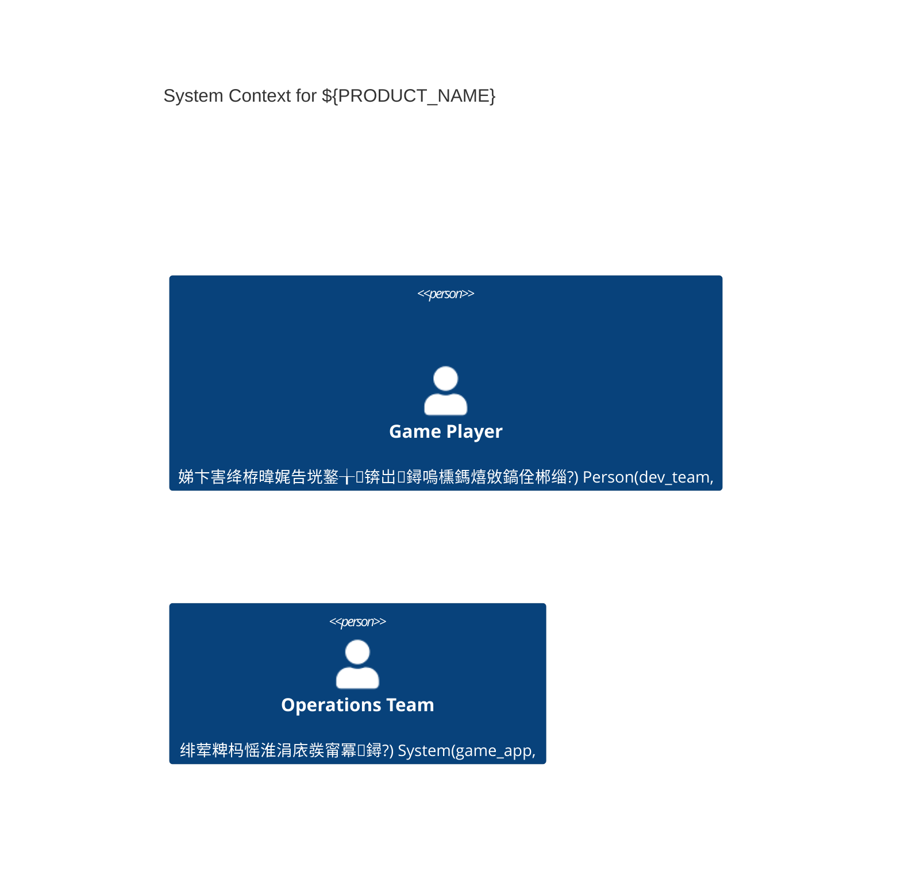

---
title: 01 绾︽潫涓庣洰鏍?鈥?Base-Clean (90-95)
status: base-SSoT
adr_refs: [ADR-0001, ADR-0002, ADR-0003, ADR-0004, ADR-0005]
placeholders: ${APP_NAME}, ${PRODUCT_NAME}, ${PRODUCT_SLUG}, ${DOMAIN_PREFIX}, ${SENTRY_ORG}, ${SENTRY_PROJECT}, ${RELEASE_PREFIX}, ${VERSION}, ${ENV}, ${CRASH_FREE_SESSIONS}
---

<!--
THIS IS THE V2 SKELETON "BASE" VERSION.
All domain-specific terms replaced with ${DOMAIN_*} placeholders.
Stable anchors preserved for cross-references.
-->

# 01 绾︽潫涓庣洰鏍囷紙v2 楠ㄦ灦锛? arc42 搂1 瀵归綈鐗堟湰

> **鐩殑**: 鎻愪緵绯荤粺绾︽潫涓庤川閲忕洰鏍囩殑缁撴瀯鍖栧畾涔夛紝寤虹珛 **SLO 鈫?璐ㄩ噺闂ㄧ** 鐨勫彲鎵ц鏄犲皠锛屼綔涓哄悗缁珷鑺傜殑鏉冨▉閿氱偣銆?
> **v2 鏀硅繘**: 瀵归綈 arc42 搂1 缁撴瀯锛屽己鍖栧彲杩借釜鎬х煩闃碉紝鏁村悎 Sentry Release Health 闂ㄧ浣撶郴銆?
---

## 1.1 鑳屾櫙涓庤寖鍥达紙Requirements Background锛?
<!-- sec:1.1 -->

### 绯荤粺瀹氫綅

- **浜у搧绫诲瀷**: 娣卞害鐢熸€佹ā鎷熸父鎴?- 鐜╁浣滀负 ${DOMAIN_GUILD} ${DOMAIN_LEADER} 绠＄悊瀹屾暣铏氭嫙鐢熸€佺郴缁?- **鎶€鏈爤鏍稿績**: Electron + React 19 + Phaser 3 + Vite + TypeScript + Tailwind CSS v4
- **骞冲彴绾︽潫**: Windows锛堜富瑕侊級銆乵acOS锛堟瑕侊級锛屾闈㈢鍙戣

### 鏍稿績杈圭晫

**鍖呭惈鑼冨洿锛圛n-Scope锛?*:

- 瀹屾暣鐨?${DOMAIN_GUILD} 绠＄悊妯℃嫙绯荤粺
- 澶氬眰AI鐢熸€侊紙${DOMAIN_MEMBER}AI + NPC${DOMAIN_GUILD}AI + 鐜AI锛?- 浜嬩欢姹犵郴缁燂紙200+ 鍩虹浜嬩欢锛?- 鏈湴鏁版嵁鎸佷箙鍖栵紙SQLite锛?
**鎺掗櫎鑼冨洿锛圤ut-of-Scope锛?*:

- 澶氫汉鍦ㄧ嚎鍔熻兘
- 瀹炴椂缃戠粶鍚屾
- 鏈嶅姟鍣ㄧ鍩虹璁炬柦

### 鐩爣鐢ㄦ埛缇や綋

- **涓昏鐢ㄦ埛**: MMO璧勬繁鐜╁锛?5-40宀侊紝鍏峰${DOMAIN_GUILD}绠＄悊缁忛獙锛?- **娆¤鐢ㄦ埛**: 娣卞害绛栫暐娓告垙鐖卞ソ鑰咃紙Football Manager銆丆rusader Kings 鐜╁锛?
---

## 0.1 绯荤粺涓婁笅鏂囨灦鏋勶紙C4 Context锛?


## 0.2 绯荤粺瀹瑰櫒鏋舵瀯锛圕4 Container锛?
```mermaid
C4Container
    title ${PRODUCT_NAME} System Containers
    System_Boundary(electron_app, "${PRODUCT_NAME} Application") {
        Container(main_process, "Main Process", "Electron/Node.js", "搴旂敤鐢熷懡鍛ㄦ湡绠＄悊涓庣郴缁熼泦鎴?)
        Container(renderer_ui, "UI Renderer", "React 19/TypeScript", "鐢ㄦ埛鐣岄潰涓庝氦浜掗€昏緫")
        Container(game_engine, "Game Engine", "Phaser 3", "娓告垙娓叉煋涓庣墿鐞嗗紩鎿?)
        Container(ai_system, "AI System", "TypeScript", "澶氬眰AI鐢熸€佹ā鎷?)
        Container(event_bus, "Event Bus", "TypeScript", "浜嬩欢姹犱笌浜嬩欢澶勭悊")
        Container(data_layer, "Data Layer", "SQLite", "鏈湴鏁版嵁鎸佷箙鍖?)
    }
    System_Boundary(quality_infra, "Quality Infrastructure") {
        Container(observability, "Observability SDK", "@sentry/electron", "閿欒杩借釜涓庢€ц兘鐩戞帶")
        Container(performance_tracker, "Performance Tracker", "TypeScript", "甯х巼涓庡搷搴旀椂闂寸洃鎺?)
        Container(health_reporter, "Health Reporter", "TypeScript", "绯荤粺鍋ュ悍鐘舵€佷笂鎶?)
    }
    System_Boundary(security_layer, "Security Layer") {
        Container(context_bridge, "Context Bridge", "Electron preload", "瀹夊叏鐨処PC閫氫俊妗ユ")
        Container(csp_policy, "CSP Policy", "Security Headers", "鍐呭瀹夊叏绛栫暐鎵ц")
        Container(permission_handler, "Permission Handler", "Electron Security", "鏉冮檺妫€鏌ヤ笌鎺у埗")
    }
    System_Ext(sentry_cloud, "${SENTRY_ORG}", "浜戠鐩戞帶鏈嶅姟")
    System_Ext(file_system, "File System", "鎿嶄綔绯荤粺鏂囦欢瀛樺偍")

    Rel(main_process, renderer_ui, "IPC閫氫俊", "contextBridge")
    Rel(renderer_ui, game_engine, "娓告垙鎺у埗", "JavaScript API")
    Rel(game_engine, ai_system, "AI浜や簰", "浜嬩欢璋冪敤")
    Rel(ai_system, event_bus, "浜嬩欢鍙戝竷", "浜嬩欢鎬荤嚎")
    Rel(event_bus, data_layer, "鏁版嵁鎸佷箙鍖?, "SQL鎿嶄綔")
    Rel(main_process, context_bridge, "瀹夊叏妗ユ帴", "preload script")
    Rel(context_bridge, permission_handler, "鏉冮檺妫€鏌?, "瀹夊叏API")
    Rel(observability, sentry_cloud, "閬ユ祴涓婃姤", "HTTPS")
    Rel(performance_tracker, health_reporter, "鎬ц兘鏁版嵁", "鍐呴儴API")
    Rel(health_reporter, observability, "鍋ュ悍鎸囨爣", "SDK闆嗘垚")
    Rel(data_layer, file_system, "鏂囦欢瀛樺偍", "SQLite鏂囦欢")
    Rel(csp_policy, renderer_ui, "瀹夊叏绾︽潫", "HTTP Headers")
```

## 1.2 璐ㄩ噺鐩爣锛圱OP 3-5 NFR 浼樺厛绾э級

#### 璐ㄩ噺鏍戯紙姒傝锛?
- 鍙潬鎬?  - 宕╂簝鐜囷紙Crash-Free锛?  - 閿欒瀵嗗害
- 鎬ц兘鏁堢巼
  - 甯х巼锛團PS锛?  - 浜嬩欢澶勭悊 TP95
  - 鍏抽敭浜や簰 TP95
- 鍙娴嬫€?  - 瑕嗙洊鐜囷紙閿欒/鏃ュ織/Sentry 閲囨牱锛?- 瀹夊叏鎬?  - Electron 鍩虹嚎锛圢ode/Context/Sandbox/CSP/Policy锛?
<!-- sec:1.2 -->

> 浠呬繚鐣?**TOP 3鈥?** 璐ㄩ噺鐩爣锛屽苟鐢ㄥ彲琛￠噺鐨?SLO 琛ㄨ揪锛圱P95/TP99銆侀槇鍊间笌瑙傛祴鏉ユ簮锛夈€?
| 缂栧彿  | 璐ㄩ噺鐩爣         | 鎸囨爣锛圡etric锛?     | 鐩爣锛圫LO锛?                            | 閲囬泦涓庡害閲?             | 閫傜敤鑼冨洿    |
| ----- | ---------------- | ------------------- | --------------------------------------- | ----------------------- | ----------- |
| NFR-1 | **鍙潬鎬?*       | Crash-Free Sessions | `>= ${CRASH_FREE_SESSIONS}%`锛堟粴鍔?4h锛?| Sentry Release Health   | 鍏ㄥ眬        |
| NFR-2 | **鎬ц兘鏁堢巼**     | 甯х巼                | 60 FPS锛堚増 16.7ms/frame锛?               | 鍐呯疆鎬ц兘璁′笌鑷畾涔夊煁鐐? | 娓告垙寰幆    |
| NFR-3 | **浜嬩欢澶勭悊鏃跺欢** | TP95                | `<= 50ms`                               | 鑷畾涔変簨浠舵€荤嚎璁￠噺      | 浜嬩欢澶勭悊    |
| NFR-4 | **鍏抽敭浜や簰鏃跺欢** | TP95                | `<= 100ms`                              | Playwright E2E + 鑷煁鐐?| UI 鍏抽敭鎿嶄綔 |
| NFR-5 | **鍙娴嬫€?*     | 閿欒涓婃姤瑕嗙洊鐜?     | `>= 95%`锛堝叧閿矾寰勶級                    | Sentry/鏃ュ織             | 鍏ㄥ眬        |

**璇存槑**

- 杩欎簺 SLO 浼氬湪 搂1.4 鏀鹃噺闂ㄧ涓綔涓?**CI 闂ㄧ** 鏉′欢銆?- 瀹屾暣璐ㄩ噺闇€姹傛爲涓庢瑕佸満鏅弬瑙?arc42 搂10锛堝湪鏈」鐩殑 搂10 绔犺妭锛夈€?
### 1.2.a 涓?ISO/IEC 25010 鐨勬槧灏?
> 灏嗘垜浠殑 NFR 鏄犲皠鍒?ISO/IEC 25010 璐ㄩ噺鐗规€э紝渚夸簬鍚庣画瀹¤涓庤法椤圭洰澶嶇敤銆?
| NFR                | ISO/IEC 25010 璐ㄩ噺鐗规€?          | 瀛愮壒鎬э紙绀轰緥锛?                         |
| ------------------ | -------------------------------- | --------------------------------------- |
| NFR-1 鍙潬鎬?      | Reliability                      | Maturity, Availability, Fault tolerance |
| NFR-2 鎬ц兘鏁堢巼     | Performance efficiency           | Time behavior, Resource utilization     |
| NFR-3 浜嬩欢澶勭悊鏃跺欢 | Performance efficiency           | Time behavior                           |
| NFR-4 鍏抽敭浜や簰鏃跺欢 | Performance efficiency/Usability | Time behavior/Operability               |
| NFR-5 鍙娴嬫€?    | Maintainability/Quality in use   | Modularity/Effectiveness                |

### 1.2.b 璐ㄩ噺鍦烘櫙锛圦AS锛岀ず渚嬶級

> 鐢?_鍒烘縺鈥撶幆澧冣€撳搷搴斺€撳害閲廮 鐨勬牸寮忕畝杩帮紙璇︾璇锋斁 搂10锛夈€?
- **QAS-1 鍙潬鎬?*锛氬綋鈥滃彂甯?vX鈥濆悗 24h 鍐咃紝鍦?*姝ｅ紡鐜**锛岀郴缁?**Crash-Free Sessions 鈮?99.5%**锛圫entry Release Health 搴﹂噺锛夈€?- **QAS-2 浜嬩欢澶勭悊**锛氬綋**浠绘剰浜嬩欢**杩涘叆浜嬩欢鎬荤嚎锛屽湪**甯歌璐熻浇**涓嬶紝**TP95 鈮?50ms**锛堣嚜鐮斿煁鐐?+ 03 绔犱华琛ㄥ害閲忥級銆?- **QAS-3 鍏抽敭浜や簰**锛氬綋鐢ㄦ埛鍦?*瀵瑰眬鐣岄潰**鎵ц鈥滃紑濮嬫父鎴忊€濓紝鍦?*甯歌璁惧**涓婏紝**TP95 鈮?100ms**锛圗2E + 鍩嬬偣锛夈€?
## 1.3 涓氬姟鐩爣 鈫?PRD 鏄犲皠妗嗘灦

<!-- sec:1.3 -->

### 鏄犲皠瑙勫垯

- **涓氬姟鐩爣** 蹇呴』鍙拷婧埌鍏蜂綋 PRD 绔犺妭
- **璐ㄩ噺灞炴€?* 蹇呴』鍏宠仈鍒板彲娴嬮噺鐨?SLO 鎸囨爣
- **鏋舵瀯鍐崇瓥** 蹇呴』寮曠敤鐩稿簲鐨?ADR 璁板綍

### 鏍稿績涓氬姟鐩爣妗嗘灦锛堝崰浣嶇妯″紡锛?
```yaml
business_goals:
  strategic_depth:
    description: '濯茬編 Football Manager 鐨勭瓥鐣ユ繁搴︿綋楠?
    prd_mapping: ['${PRD_CHUNK_001}', '${PRD_CHUNK_003}']
    quality_attributes: ['usability', 'maintainability']

  ecosystem_simulation:
    description: '澶氫富浣?AI 鐢熸€佹ā鎷熷垱鏂?
    prd_mapping: ['${PRD_CHUNK_002}', '${PRD_CHUNK_004}']
    quality_attributes: ['performance', 'reliability']

  long_term_playability:
    description: '澶嶆潅 AI 浜掑姩鎻愪緵鎸佺画鏂伴矞浣撻獙'
    prd_mapping: ['${PRD_CHUNK_005}', '${PRD_CHUNK_006}']
    quality_attributes: ['maintainability', 'usability']
```

### PRD 瀵归綈楠岃瘉鏈哄埗

- **鍓嶅悜杩借釜**: 姣忎釜涓氬姟鐩爣 鈫?PRD 闇€姹?鈫?鏋舵瀯缁勪欢
- **鍚庡悜杩借釜**: 姣忎釜鏋舵瀯鍐崇瓥 鈫?涓氬姟浠峰€?鈫?鐢ㄦ埛鏁呬簨
- **褰卞搷鍒嗘瀽**: 闇€姹傚彉鏇?鈫?鍙楀奖鍝嶇粍浠?鈫?娴嬭瘯鑼冨洿

---

## 1.4 鏀鹃噺闂ㄧ锛圫LO/Release Health锛?
<!-- sec:1.4 -->

### Release Health 闂ㄧ涓庨槇鍊硷紙ENV 鍙厤锛?
| 鍙橀噺                         | 榛樿鍊? | 鍚箟                                     |
| ---------------------------- | ------- | ---------------------------------------- |
| `RH_WINDOW_HOURS`            | `24`    | 缁熻绐楀彛锛堝皬鏃讹級                         |
| `RH_MIN_ADOPTION`            | `0.05`  | 鏈€灏忔斁閲忓崰姣旓紝鐢ㄤ簬璁＄畻 crash-free 鍙俊搴?|
| `RH_CRASH_FREE_SESSIONS_MIN` | `0.995` | Crash-Free Sessions 涓嬮檺                 |
| `RH_CRASH_FREE_USERS_MIN`    | `0.995` | Crash-Free Users 涓嬮檺                    |
| `RH_NO_REGRESSION`           | `true`  | 鐩告瘮涓婁竴 release 涓嶅厑璁稿洖閫€              |

### CI 闃舵鑴氭湰锛堝崰浣嶏級

```powershell
node scripts/release-health-gate.js   --window %RH_WINDOW_HOURS%   --adoption %RH_MIN_ADOPTION%   --min-cfs %RH_CRASH_FREE_SESSIONS_MIN%   --min-cfu %RH_CRASH_FREE_USERS_MIN%   --no-regression %RH_NO_REGRESSION%
```

> 鏁版嵁鏉ユ簮锛歋entry Release Health API锛涜嫢鏃犺冻澶熸牱鏈噺锛坅doption 杩囦綆锛夛紝鍒欐帹杩熸斁閲忋€?
### 閿欒棰勭畻锛圗rror Budget锛変笌绛栫暐锛圥olicy锛?
- **閿欒棰勭畻** = 1 鈭?SLO銆備緥濡?SLO=99.5% 鈬?鍙蹇嶉敊璇?0.5%銆?- **Burn Rate 鐩戞帶**锛氬湪 搂03/搂07 鎶ヨ涓洃鎺ч绠楃噧灏介€熷害锛涘綋鐭獥/闀跨獥鍚屾椂瓒呴槇锛屽嵆瑙﹀彂楂樹紭鍏堢骇鍛婅銆?- **绛栫暐绀轰緥**锛?  - **鑰楀敖/瓒呴€?*锛氬喕缁撴柊鍔熻兘鍙戝竷锛岃浆鍏ョ己闄蜂慨澶嶏紙P1锛夛紱鎭㈠鍒伴绠楀唴骞惰繛缁?7 澶╃ǔ瀹氬悗瑙ｅ喕銆?  - **鎺ヨ繎涓嬮檺**锛氳繘鍏モ€滈粍鑹测€濈姸鎬侊紝鏀鹃噺鈮?X%锛涘繀瑕佹椂鎷夐暱瑙傚療绐椼€?  - **鍋ュ悍**锛氭寜璁″垝鎺ㄨ繘锛屽厑璁告甯告斁閲忋€?
> 璇存槑锛氬叿浣撻槇鍊间笌绐楀彛鍦?搂07 闂ㄧ涓?搂03 鎶ヨ妯℃澘涓惤鍦帮紝涓旈渶骞茬郴浜猴紙PM/Dev/Ops锛夊叡鍚屾壒鍑嗐€?
## 1.5 纭害鏉燂紙鍚?Electron 瀹夊叏鍩虹嚎锛?
<!-- sec:1.5 -->

### Electron 瀹夊叏鍩虹嚎锛堝己鍒讹級

- `nodeIntegration=false`銆乣contextIsolation=true`銆乣sandbox=true`
- 涓ユ牸 `Content-Security-Policy`锛堢敓浜ч€氳繃**鍝嶅簲澶?*娉ㄥ叆锛涘紑鍙戝彲 `meta` 鍏滃簳锛?- 榛樿 **Permissions-Policy** 鎷掔粷楂樺嵄鑳藉姏锛堜緥濡?`geolocation=(), camera=(), microphone=()`锛?- `Cross-Origin-Opener-Policy: same-origin`锛沗Cross-Origin-Embedder-Policy: require-corp`锛堟寜鐗规€у紑鍏筹級
- IPC **鐧藉悕鍗?+ 鍙屽鐞嗗櫒**锛歚setPermissionCheckHandler` + `setPermissionRequestHandler`

### 鎶€鏈爤涓庣増鏈害鏉?
- Electron/Node/Chromium 涓荤増鏈笅闄愮敱 搂7 璐ㄩ噺闂ㄧ鑴氭湰鏍￠獙
- 鍓嶇鏍堬細Electron + React 18 + Vite + TypeScript + Tailwind CSS + Phaser 3

## 1.6 骞茬郴浜猴紙Stakeholders锛?
<!-- sec:1.6 -->

### RACI锛堟灦鏋勪笌鏀鹃噺闂ㄧ锛?
| 浜嬮」                    | R               | A          | C         | I    |
| ----------------------- | --------------- | ---------- | --------- | ---- |
| ADR 鍙樻洿/鏂板           | 鏋舵瀯璐熻矗浜?     | 浜у搧璐熻矗浜?| 寮€鍙?娴嬭瘯 | 鍏ㄤ綋 |
| Release Health 鏀鹃噺鍐崇瓥 | 杩愮淮/鍙戝竷璐熻矗浜?| 浜у搧璐熻矗浜?| 鏋舵瀯/QA   | 鍏ㄤ綋 |
| 瀹夊叏鍩虹嚎鍙樻洿            | 鏋舵瀯璐熻矗浜?     | 浜у搧璐熻矗浜?| 瀹夊叏/寮€鍙?| 鍏ㄤ綋 |
| 鎬ц兘 SLO 鍙樻洿           | 鏋舵瀯璐熻矗浜?     | 浜у搧璐熻矗浜?| 寮€鍙?QA   | 鍏ㄤ綋 |

### RACI锛圫LO/閿欒棰勭畻娌荤悊锛?
| 浜嬮」             | R         | A          | C       | I    |
| ---------------- | --------- | ---------- | ------- | ---- |
| SLO 璁惧畾/淇    | 鏋舵瀯/鍚庣 | 浜у搧璐熻矗浜?| SRE/QA  | 鍏ㄤ綋 |
| 閿欒棰勭畻绛栫暐瀹℃壒 | 鏋舵瀯/杩愮淮 | 浜у搧璐熻矗浜?| 瀹夊叏/QA | 鍏ㄤ綋 |
| 鏀鹃噺鑺傚涓庡喕缁?  | 杩愮淮/鍙戝竷 | 浜у搧璐熻矗浜?| 鏋舵瀯/QA | 鍏ㄤ綋 |

## 1.7 椋庨櫓涓庡亣璁撅紙Risks & Assumptions锛?
<!-- sec:1.7 -->

### 椋庨櫓锛堢ず渚嬶級

| 椋庨櫓ID | 鎻忚堪                                               | 褰卞搷 | 姒傜巼 | 缂撹В/搴斿                                            |
| ------ | -------------------------------------------------- | ---- | ---- | ---------------------------------------------------- |
| R-01   | 绗笁鏂逛緷璧栧畨鍏ㄧ己闄峰鑷磋鍔ㄥ崌鐗?                    | 楂?  | 涓?  | 搂07 娴佹按绾垮紑鍚?`npm audit` 涓ユ牸妯″紡 + 渚嬪鐧藉悕鍗曡瘎瀹?|
| R-02   | COEP 鎵撳紑鍚庣涓夋柟璧勬簮鏈甫 CORS/CORP 瀵艰嚧鍔熻兘涓嶅彲鐢?| 涓?  | 涓?  | 浠?*鐗规€ф棗鏍?*鐏板害 COEP锛屾彁渚涘洖閫€                    |
| R-03   | Sentry 閲囨牱鎴栦笂鎶ョ瓥鐣ヤ笉褰撳奖鍝?Crash-Free 鍙俊搴?   | 涓?  | 浣?  | 鏍″噯閲囨牱鐜囷紝浣庝娇鐢ㄩ噺闃舵鐢ㄦ洿闀胯娴嬬獥                 |
| R-04   | 璺ㄥ钩鍙板樊寮傦紙Windows/macOS/Linux锛夊鑷磋涓轰笉涓€鑷?   | 涓?  | 涓?  | 鍦?搂07 寮曞叆涓夊钩鍙扮煩闃?E2E 鍐掔儫                       |
| R-05   | 鎬ц兘鍥為€€锛堝抚鐜?TP95锛夋湭琚強鏃跺彂鐜?                 | 涓?  | 涓?  | 搂03 鍙娴?搂07 闂ㄧ鍙岄噸鐩戞帶锛屽洖閫€鑷姩闃绘柇            |

### 鏍稿績鍋囪

- 鍏佽鍦ㄥ彂甯冪閬撲腑鎷夊彇 Sentry Release Health 鎸囨爣
- 鍏佽鍦?Electron 涓昏繘绋嬫敞鍏ュ搷搴斿ご锛堣嚜瀹氫箟 `app://` 鍗忚锛?
## 1.8 鏈琛紙Glossary锛?
<!-- sec:1.8 -->

- **TP95**锛?5 鐧惧垎浣嶇殑鍝嶅簲鏃堕棿/鏃跺欢锛岃〃绀?95% 鐨勮姹備笉瓒呰繃璇ュ€?- **Crash-Free Sessions/Users**锛氬湪缁熻鏃堕棿绐楀唴鏈彂鐢熷穿婧冪殑浼氳瘽/鐢ㄦ埛鍗犳瘮锛圫entry 瀹氫箟锛?- **Release Health**锛歋entry 瀵圭増鏈淮搴︾殑鍋ュ悍搴﹀害閲忥紙宕╂簝鐜囥€侀噰绾崇巼銆佽秼鍔跨瓑锛?- **ADR**锛欰rchitecture Decision Record锛屾灦鏋勫喅绛栬褰?- **SLO**锛歋ervice Level Objective锛屾湇鍔＄骇鐩爣锛堝彲閲忓寲锛?- **Overlay**锛歄verlay 鏂囨。灞傦紝鎸?PRD-ID 绾靛垏琛ュ厖棰嗗煙缁嗚妭

## 1.9 鍙拷韪叧绯伙紙Traceability Matrix锛?
<!-- sec:1.9 -->

### PRD-ID 鈫?NFR/SLO 鈫?ADR 鈫?娴嬭瘯杩借釜琛?
| PRD-ID  | 涓氬姟鐩爣       | 瀵瑰簲 NFR/SLO          | 鐩稿叧 ADR               | 娴嬭瘯寮曠敤锛坲nit/contract/e2e锛?|
| ------- | -------------- | --------------------- | ---------------------- | ----------------------------- |
| PRD-XXX | 绀轰緥锛氱櫥褰曟祦绋?| NFR-3 浜嬩欢 TP95<=50ms | ADR-0005 Quality Gates | tests/e2e/auth.spec.ts#L10    |

### 鍙屽悜鍙拷韪€ч獙璇?
- 鍙樻洿 PRD-ID 蹇呴』鏇存柊鏈〃锛汸R 瀹℃牳妫€鏌ュ紩鐢ㄥ畬鏁存€?- CI 涓鍔犺拷韪竴鑷存€ф鏌ヨ剼鏈崰浣?
### PRD-ID 鈫?NFR/SLO 鈫?ADR 鈫?娴嬭瘯 鈫?Owner 鈫?璇佹嵁

| PRD-ID  | 涓氬姟鐩爣 | 瀵瑰簲 NFR/SLO    | 鐩稿叧 ADR | 娴嬭瘯寮曠敤                   | Owner | 璇佹嵁锛圖ashboard/Report锛?       |
| ------- | -------- | --------------- | -------- | -------------------------- | ----- | ------------------------------- |
| PRD-XXX | 鐧诲綍娴佺▼ | NFR-3 TP95鈮?0ms | ADR-0005 | tests/e2e/auth.spec.ts#L10 | QA    | Sentry Release Health / Grafana |

## 1.10 鏂囨。楠屾敹娓呭崟锛圖ocument Acceptance Checklist锛?
<!-- sec:1.10 -->

- [ ] 灏忚妭瀹屾暣锛?.1鈥?.10锛変笖 **閿氱偣榻愬叏**锛坄<!-- sec:X.X -->`锛?- [ ] **NFR/SLO 鍙噺鍖?*锛屽苟涓?搂1.4 鏀鹃噺闂ㄧ鑱斿姩
- [ ] **纭害鏉熸竻鏅?*锛圗lectron 瀹夊叏鍩虹嚎銆佺瓥鐣ュご銆両PC 鐧藉悕鍗曪級
- [ ] **杩借釜鐭╅樀**鍙弻鍚戞绱紙PRD 鈫?NFR/SLO 鈫?ADR 鈫?娴嬭瘯锛?- [ ] **濂戠害浠ｇ爜/娴嬭瘯鍗犱綅**瀛樺湪骞惰兘 `pnpm test` 閫氳繃

**琛ュ厖妫€鏌ラ」**

- [ ] 搂1.2 鍚?**ISO 25010 鏄犲皠**涓?*鑷冲皯3涓?QAS** 绀轰緥
- [ ] 搂1.4 鍚?**閿欒棰勭畻绛栫暐** 鎽樿锛堝苟涓?搂03/搂07 瀵归綈锛?- [ ] 杩借釜鐭╅樀鍖呭惈 **Owner** 涓?**璇佹嵁閾炬帴**

## 闄勫綍锛歍ypeScript 濂戠害涓庢祴璇曞崰浣?
<!-- sec:appendix -->

### src/shared/contracts/quality.ts

```typescript
export type QualityId =
  | 'reliability'
  | 'perf'
  | 'event-latency'
  | 'ux-latency'
  | 'observability';

export interface SLO {
  id: string;
  metric: 'crash_free_sessions' | 'fps' | 'tp95' | 'coverage';
  target: number;
  windowHours?: number;
}

export interface QualityGoal {
  id: QualityId;
  title: string;
  slos: SLO[];
}

export const QUALITY_GOALS: QualityGoal[] = [
  {
    id: 'reliability',
    title: '鍙潬鎬?,
    slos: [
      {
        id: 'CFS',
        metric: 'crash_free_sessions',
        target: 0.995,
        windowHours: 24,
      },
    ],
  },
  {
    id: 'perf',
    title: '甯х巼',
    slos: [{ id: 'FPS', metric: 'fps', target: 60 }],
  },
  {
    id: 'event-latency',
    title: '浜嬩欢澶勭悊鏃跺欢',
    slos: [{ id: 'EV_TP95', metric: 'tp95', target: 50 }],
  },
  {
    id: 'ux-latency',
    title: '鍏抽敭浜や簰鏃跺欢',
    slos: [{ id: 'UX_TP95', metric: 'tp95', target: 100 }],
  },
  {
    id: 'observability',
    title: '鍙娴嬫€?,
    slos: [{ id: 'ERR_COV', metric: 'coverage', target: 0.95 }],
  },
];
```

### tests/unit/quality.spec.ts

```ts
import { describe, it, expect } from 'vitest';
import { QUALITY_GOALS } from '../../src/shared/contracts/quality';

describe('quality goals', () => {
  it('has crash-free sessions SLO >= 0.995', () => {
    const cfs = QUALITY_GOALS.find(g => g.id === 'reliability')!.slos[0];
    expect(cfs.target).toBeGreaterThanOrEqual(0.995);
  });
});
```

