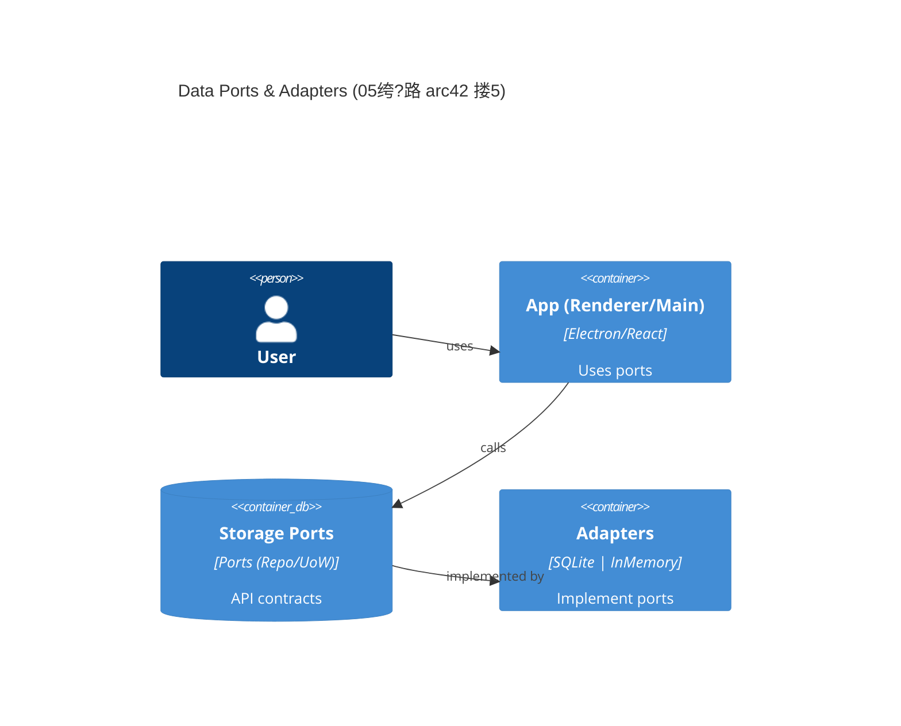
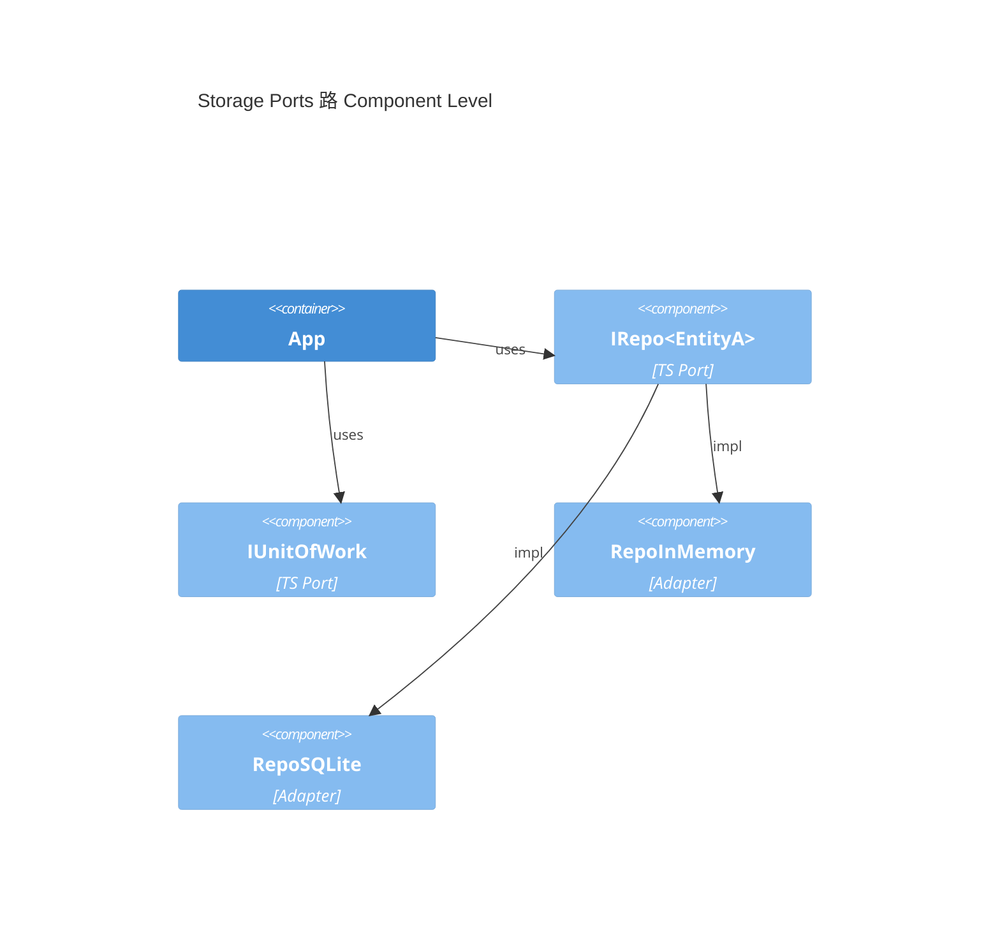

---
title: 05 鏁版嵁妯″瀷涓庡瓨鍌ㄧ鍙?鈥?merged锛圔ase鈥慍lean路23/23锛?status: base-SSoT
adr_refs: [ADR-0001, ADR-0002, ADR-0003, ADR-0004, ADR-0005, ADR-0006, ADR-0007]
placeholders: ${APP_NAME}, ${PRODUCT_NAME}, ${DOMAIN_PREFIX}, ${ENTITY_A}, ${ENTITY_B}, ${AGGREGATE_A}, ${ENV}, ${RELEASE_PREFIX}, ${VERSION}
derived_from: 05-data-models-and-storage-ports-v2.merged.md
last_adjusted: 2025-08-21
---

## C4锛堟渶灏忛潤鎬佸垎瑙ｏ紝鑱氱劍绔彛鈥旈€傞厤鍣級

> 瀵归綈 arc42 搂5 鈥滈潤鎬佸垎瑙ｂ€濓紝鏈珷浠呯粰鏈€灏?C4 瀹瑰櫒/缁勪欢鍥撅紱鏇撮珮灞?Context/Container 璇峰弬鑰冪 04 绔犮€?




> 鐩爣锛氫互 **绔彛-閫傞厤鍣紙Hexagonal锛?* 琛ㄨ揪 Chapter 05 鐨?*鍞竴浜嬪疄婧愶紙SSoT锛?*鈥斺€旀暟鎹ā鍨嬩笌瀛樺偍绔彛銆備弗鏍?**Base-Clean**锛氫笉缁戝畾鍏蜂綋浜戝巶鍟嗭紱榛樿瀹炵幇浠呮湁 InMemory 涓?SQLite锛圵AL锛夈€傛湰鐗堟湰鏁村悎鐗╃悊瀹炵幇涓庤縼绉荤瓥鐣ワ紝鎻愪緵鐢熶骇绾ф暟鎹簱绠＄悊鑳藉姏銆?
## 馃Л SSoT 杈圭晫涓庢函婧愶紙瀵归綈 arc42 搂5锛?
- 鏈珷浠呭畾涔?**绔彛濂戠害** 涓?**鑱氬悎鐨勬寔涔呭寲缁撴瀯**锛涜繍琛屾椂/瑙傛祴/閮ㄧ讲鍒嗗埆鍦?06/03/07 绔犮€?- ADR 鍏宠仈锛?*ADR-0001/0002/0003/0004/0005/0007**銆傛鏂囧湪鐩稿簲灏忚妭鍐?*鑷冲皯涓€娆?*寮曠敤 ADR 缂栧彿浠ヤ究杩芥函銆?- **鐗╃悊瀹炵幇鎵╁睍**锛氭暣鍚?11 绔犳暟鎹簱瀹炵幇缁嗚妭锛屽寘鍚?Schema 鐗堟湰绠＄悊銆佸浠界瓥鐣ャ€佸仴搴锋鏌ョ瓑鐢熶骇绾х壒鎬с€?
---

## 1) 绔彛濂戠害锛堟渶灏忓彲鎵ц闆嗭級

> 绔彛鍛藉悕閬靛惊"涓哄仛鏌愪簨锛團or_doing_something锛?璇箟锛涢鍩熷眰**涓嶄緷璧?*鍏蜂綋鏁版嵁搴?鏂囦欢绯荤粺銆傝 ADR-0004 / ADR-0005銆?
```typescript
// src/shared/contracts/ports/Port.ts
export interface Port {
  readonly portType: 'primary' | 'secondary';
  readonly portName: string;
}
export interface IRepository<TAgg, TId> extends Port {
  readonly portType: 'secondary';
  findById(id: TId): Promise<TAgg | null>;
  save(agg: TAgg): Promise<void>;
  delete(id: TId): Promise<void>;
}
export interface IUnitOfWork extends Port {
  readonly portType: 'secondary';
  begin(): Promise<void>;
  commit(): Promise<void>;
  rollback(): Promise<void>;
  execute<T>(op: () => Promise<T>): Promise<T>;
}
export interface IHealthCheck extends Port {
  readonly portType: 'secondary';
  check(): Promise<{ healthy: boolean; details: Record<string, unknown> }>;
}
export interface IMigration extends Port {
  readonly portType: 'secondary';
  getCurrentVersion(): Promise<number>;
  migrate(
    targetVersion?: number
  ): Promise<{ from: number; to: number; applied: string[] }>;
  rollback(
    targetVersion: number
  ): Promise<{ from: number; to: number; reverted: string[] }>;
}
```

```typescript
// src/shared/contracts/models/Aggregates.ts
export type Id = string & { __brand: 'Id' };
export interface EntityA {
  id: Id;
  name: string;
  level: number;
  updatedAt: string;
}
export interface EntityB {
  id: Id;
  name: string;
  memberIds: Id[];
  updatedAt: string;
}
export interface SaveGame {
  id: Id;
  slot: number;
  blob: Uint8Array;
  updatedAt: string;
}
```

```typescript
// src/shared/contracts/repositories/RepoMap.ts
import type { IRepository, Id, EntityA, EntityB, SaveGame } from './types';
export interface RepoMap {
  character: IRepository<EntityA, Id>;
  guild: IRepository<EntityB, Id>;
  savegame: IRepository<SaveGame, Id>;
}
```

```typescript
// src/shared/adapters/memory/InMemoryRepository.ts
import type { IRepository } from '@/shared/contracts/ports/Port';
export class InMemoryRepository<TAgg extends { id: any }, TId>
  implements IRepository<TAgg, TId>
{
  readonly portType = 'secondary' as const;
  readonly portName = 'InMemoryRepository';
  private store = new Map<string, TAgg>();
  constructor(private toKey: (id: TId) => string) {}
  async findById(id: TId) {
    return this.store.get(this.toKey(id)) ?? null;
  }
  async save(agg: TAgg) {
    this.store.set(this.toKey(agg.id), JSON.parse(JSON.stringify(agg)));
  }
  async delete(id: TId) {
    this.store.delete(this.toKey(id));
  }
}
```

```typescript
// tests/unit/ports.contract.test.ts
import { expect, test } from 'vitest';
import { InMemoryRepository } from '@/shared/adapters/memory/InMemoryRepository';
test('inmemory repo basic CRUD', async () => {
  const repo = new InMemoryRepository<any, string>(id => id);
  await repo.save({ id: '1', name: 'n', updatedAt: new Date().toISOString() });
  expect(await repo.findById('1')).not.toBeNull();
  await repo.delete('1');
  expect(await repo.findById('1')).toBeNull();
});
```

---

## 2) SQLite 鐢熶骇绾у疄鐜帮紙WAL / 澶囦唤 / 鍥炴粴 / 鍋ュ悍妫€鏌ワ級

> 鍩轰簬 ADR-0002锛堝畨鍏ㄥ熀绾匡級涓?ADR-0005锛堣川閲忛棬绂侊級锛屾彁渚涗紒涓氱骇 SQLite 鏁版嵁绠＄悊鑳藉姏銆?
### 2.0 SQLite蹇€熼厤缃紙3鍒嗛挓涓婃墜锛?
**寮€鍙戠幆澧冩帹鑽愰厤缃?*锛?
```sql
-- 鍚敤WAL妯″紡锛堟彁鍗囧苟鍙戞€ц兘锛?PRAGMA journal_mode = WAL;
-- 鏅€氬悓姝ワ紙寮€鍙戠幆澧冨钩琛℃€ц兘鍜屽畨鍏ㄦ€э級
PRAGMA synchronous = NORMAL;
-- 澧炲姞缂撳瓨澶у皬锛?0MB锛屾彁鍗囨煡璇㈡€ц兘锛?PRAGMA cache_size = 10000;
-- 鍚敤澶栭敭绾︽潫锛堟暟鎹畬鏁存€э級
PRAGMA foreign_keys = ON;
-- 璁剧疆蹇欑瓒呮椂锛堥槻姝㈤攣鍐茬獊锛?PRAGMA busy_timeout = 5000;
```

**鐢熶骇鐜鎺ㄨ崘閰嶇疆**锛?
```sql
-- 鍚敤WAL妯″紡锛堥珮骞跺彂鏀寔锛?PRAGMA journal_mode = WAL;
-- 瀹屽叏鍚屾锛堢敓浜х幆澧冩暟鎹畨鍏ㄤ紭鍏堬級
PRAGMA synchronous = FULL;
-- 澶х紦瀛橈紙50MB锛岀敓浜х幆澧冩€ц兘浼樺寲锛?PRAGMA cache_size = 50000;
-- 鍚敤澶栭敭绾︽潫
PRAGMA foreign_keys = ON;
-- WAL鑷姩妫€鏌ョ偣锛堟瘡1000椤碉紝鎺у埗WAL鏂囦欢澧為暱锛?PRAGMA wal_autocheckpoint = 1000;
-- 璁剧疆鏇撮暱鐨勫繖纰岃秴鏃讹紙楂樺苟鍙戠幆澧冿級
PRAGMA busy_timeout = 10000;
```

**TypeScript 閰嶇疆灏佽**锛?
```typescript
// src/shared/adapters/sqlite/SqliteConfig.ts
export const SQLITE_CONFIG = {
  development: {
    journal_mode: 'WAL',
    synchronous: 'NORMAL',
    cache_size: 10000,
    foreign_keys: 'ON',
    busy_timeout: 5000,
  },
  production: {
    journal_mode: 'WAL',
    synchronous: 'FULL',
    cache_size: 50000,
    foreign_keys: 'ON',
    wal_autocheckpoint: 1000,
    busy_timeout: 10000,
  },
} as const;

export function applySqliteConfig(
  db: Database,
  env: 'development' | 'production'
): void {
  const config = SQLITE_CONFIG[env];
  Object.entries(config).forEach(([pragma, value]) => {
    db.exec(`PRAGMA ${pragma} = ${value};`);
  });
}
```

**甯歌闂閫熸煡**锛?
- **WAL鏂囦欢杩囧ぇ**锛氳皟鏁?`wal_autocheckpoint` 鍊硷紝鎴栨墜鍔?`PRAGMA wal_checkpoint;`
- **SQLITE_BUSY閿欒**锛氬鍔?`busy_timeout` 鍊兼垨浣跨敤閲嶈瘯鏈哄埗
- **纾佺洏绌洪棿涓嶈冻**锛氱洃鎺AL鏂囦欢澶у皬锛屽強鏃舵墽琛宑heckpoint
- **鎬ц兘璋冧紭**锛氭牴鎹唴瀛樺ぇ灏忚皟鏁?`cache_size`锛岀敓浜х幆澧冨缓璁缃负鍙敤鍐呭瓨鐨?5%

### 2.1 Schema鐗堟湰涓庤縼绉荤瓥鐣?
**鏍稿績鍘熷垯**锛氫娇鐢?`PRAGMA user_version` 缁存姢Schema鐗堟湰锛屾敮鎸佹鍚戣縼绉诲拰鍥炴粴鎿嶄綔銆?
```typescript
// src/shared/adapters/sqlite/SqliteMigration.ts
import type { IMigration } from '@/shared/contracts/ports/Port';
export class SqliteMigration implements IMigration {
  readonly portType = 'secondary' as const;
  readonly portName = 'SqliteMigration';

  constructor(private dbFile = process.env.DB_FILE || '${DB_FILE}') {}

  async getCurrentVersion(): Promise<number> {
    // SELECT user_version FROM pragma_user_version
    return 0; // TODO: implement SQLite query
  }

  async migrate(
    targetVersion?: number
  ): Promise<{ from: number; to: number; applied: string[] }> {
    const from = await this.getCurrentVersion();
    const to = targetVersion ?? this.getLatestVersion();
    const applied: string[] = [];

    for (let v = from + 1; v <= to; v++) {
      const migrationFile = `${process.env.MIGRATIONS_DIR || '${MIGRATIONS_DIR}'}/${v.toString().padStart(4, '0')}_*.sql`;
      // TODO: execute migration file
      applied.push(migrationFile);
    }

    // UPDATE user_version
    return { from, to, applied };
  }

  async rollback(
    targetVersion: number
  ): Promise<{ from: number; to: number; reverted: string[] }> {
    const from = await this.getCurrentVersion();
    const reverted: string[] = [];

    for (let v = from; v > targetVersion; v--) {
      const rollbackFile = `${process.env.MIGRATIONS_DIR || '${MIGRATIONS_DIR}'}/${v.toString().padStart(4, '0')}_*_down.sql`;
      // TODO: execute rollback file
      reverted.push(rollbackFile);
    }

    return { from, to: targetVersion, reverted };
  }

  private getLatestVersion(): number {
    // TODO: scan migration files and return max version
    return Number(process.env.SCHEMA_VERSION || '${SCHEMA_VERSION}') || 1;
  }
}
```

```sql
-- migrations/0001_init.sql
PRAGMA foreign_keys=ON; PRAGMA journal_mode=WAL;
CREATE TABLE character (id TEXT PRIMARY KEY, name TEXT NOT NULL, level INTEGER DEFAULT 1, updatedAt TEXT NOT NULL);
CREATE INDEX idx_character_level ON character(level);
CREATE TABLE guild (id TEXT PRIMARY KEY, name TEXT NOT NULL, updatedAt TEXT NOT NULL);
CREATE TABLE guild_member (guildId TEXT, memberId TEXT, PRIMARY KEY(guildId, memberId),
  FOREIGN KEY(guildId) REFERENCES guild(id), FOREIGN KEY(memberId) REFERENCES character(id));
PRAGMA user_version = 1;
```

```typescript
// tests/unit/migration.test.ts
import { expect, test } from 'vitest';
import { SqliteMigration } from '@/shared/adapters/sqlite/SqliteMigration';

test('migration tracks version correctly', async () => {
  const migration = new SqliteMigration(':memory:');
  expect(await migration.getCurrentVersion()).toBe(0);
  const result = await migration.migrate(1);
  expect(result.from).toBe(0);
  expect(result.to).toBe(1);
});
```

### 2.2 澶囦唤/蹇収涓庝繚鐣欑瓥鐣?
**绛栫暐**锛氫娇鐢?`VACUUM INTO` 鐢熸垚涓€鑷存€у揩鐓э紝淇濈暀鏈€杩?浠藉浠斤紝鏀寔鍩轰簬鏃堕棿鐐圭殑鎭㈠銆?
```typescript
// src/shared/adapters/sqlite/SqliteBackup.ts
export interface IBackupManager extends Port {
  readonly portType: 'secondary';
  createBackup(
    name?: string
  ): Promise<{ path: string; size: number; checksum: string }>;
  listBackups(): Promise<
    Array<{ path: string; created: string; size: number }>
  >;
  restoreFromBackup(backupPath: string): Promise<void>;
  cleanupOldBackups(keepCount?: number): Promise<string[]>;
}

export class SqliteBackupManager implements IBackupManager {
  readonly portType = 'secondary' as const;
  readonly portName = 'SqliteBackupManager';

  constructor(
    private dbFile = process.env.DB_FILE || '${DB_FILE}',
    private backupDir = process.env.BACKUP_DIR || '${BACKUP_DIR}'
  ) {}

  async createBackup(name?: string): Promise<{
    path: string;
    size: number;
    checksum: string;
    duration: number;
    compressionRatio?: number;
    metadata: BackupMetadata;
  }> {
    const startTime = Date.now();
    const timestamp = new Date().toISOString().replace(/[:.]/g, '-');
    const backupName =
      name || `${process.env.PRODUCT_SLUG || '${PRODUCT_SLUG}'}-${timestamp}`;
    const backupPath = `${this.backupDir}/${backupName}.db`;

    try {
      // 纭繚澶囦唤鐩綍瀛樺湪
      await this.ensureBackupDirectory();

      // 鎵ц棰勬鏌?      await this.preBackupCheck();

      // 鎵ц澧炲己鐨刅ACUUM INTO澶囦唤锛堝師瀛愭搷浣滐級
      await this.executeEnhancedBackup(backupPath);

      // 鑾峰彇澶囦唤鏂囦欢淇℃伅
      const backupSize = await this.getFileSize(backupPath);
      const originalSize = await this.getFileSize(this.dbPath);

      // 璁＄畻鏍￠獙鍜?      const checksum = await this.calculateFileChecksum(backupPath);

      // 璁＄畻鍘嬬缉姣?      const compressionRatio =
        originalSize > 0 ? (originalSize - backupSize) / originalSize : 0;

      const duration = Date.now() - startTime;

      // 鍒涘缓澶囦唤鍏冩暟鎹?      const metadata: BackupMetadata = {
        name: backupName,
        created: new Date().toISOString(),
        source: this.dbPath,
        version: await this.getDatabaseVersion(),
        walSize: await this.getWALSize(),
        method: 'VACUUM_INTO',
        verified: false,
      };

      // 楠岃瘉澶囦唤瀹屾暣鎬?      await this.verifyBackupIntegrity(backupPath);
      metadata.verified = true;

      // 淇濆瓨澶囦唤鍏冩暟鎹?      await this.saveBackupMetadata(backupPath, metadata);

      // 鎵ц澶囦唤淇濈暀绛栫暐
      await this.applyRetentionPolicy();

      console.log(
        `鉁?澶囦唤鍒涘缓鎴愬姛: ${backupPath} (${this.formatBytes(backupSize)}, ${duration}ms, ${(compressionRatio * 100).toFixed(1)}%鍘嬬缉)`
      );

      return {
        path: backupPath,
        size: backupSize,
        checksum,
        duration,
        compressionRatio,
        metadata,
      };
    } catch (error) {
      console.error(`鉂?澶囦唤鍒涘缓澶辫触: ${error}`);

      // 娓呯悊澶辫触鐨勫浠芥枃浠?      try {
        await this.deleteFile(backupPath);
      } catch {}

      throw new Error(
        `澶囦唤鍒涘缓澶辫触: ${error instanceof Error ? error.message : error}`
      );
    }
  }

  private async executeEnhancedBackup(backupPath: string): Promise<void> {
    // Step 1: 寮哄埗WAL妫€鏌ョ偣浠ョ‘淇濇暟鎹竴鑷存€?    await this.executeSQL('PRAGMA wal_checkpoint(FULL)');

    // Step 2: 涓存椂澧炲姞缂撳瓨澶у皬浠ヤ紭鍖朧ACUUM鎬ц兘
    const originalCacheSize = (await this.executeSQL(
      'PRAGMA cache_size'
    )) as number;
    await this.executeSQL('PRAGMA cache_size = 100000'); // 澧炲姞鍒皛400MB缂撳瓨

    try {
      // Step 3: 鎵ц浼樺寲鐨刅ACUUM INTO锛堝寘鍚墍鏈夋暟鎹拰绱㈠紩浼樺寲锛?      await this.executeSQL(`VACUUM INTO '${backupPath}'`);

      // Step 4: 瀵瑰浠芥墽琛屽垎鏋愮粺璁℃洿鏂?      const backupConn = await this.createTempConnection(backupPath);
      await backupConn.execute('ANALYZE');
      await backupConn.close();
    } finally {
      // Step 5: 鎭㈠鍘熷缂撳瓨澶у皬
      await this.executeSQL(`PRAGMA cache_size = ${originalCacheSize}`);
    }
  }

  private async preBackupCheck(): Promise<void> {
    // 妫€鏌ユ暟鎹簱杩炴帴鐘舵€?    await this.executeSQL('SELECT 1');

    // 鎵ц瀹屾暣鎬ф鏌?    const integrityCheck = (await this.executeSQL(
      'PRAGMA integrity_check'
    )) as string;
    if (integrityCheck !== 'ok') {
      throw new Error(`鏁版嵁搴撳畬鏁存€ф鏌ュけ璐? ${integrityCheck}`);
    }

    // 妫€鏌ョ鐩樼┖闂达紙鑷冲皯闇€瑕?.5鍊嶆暟鎹簱澶у皬鐨勭┖闂茬┖闂达級
    const dbSize = await this.getFileSize(this.dbPath);
    const freeSpace = await this.getFreeDiskSpace();
    if (freeSpace < dbSize * 1.5) {
      throw new Error(
        `纾佺洏绌洪棿涓嶈冻锛岄渶瑕?{this.formatBytes(dbSize * 1.5)}锛屽綋鍓嶅彲鐢?{this.formatBytes(freeSpace)}`
      );
    }

    // 妫€鏌ユ槸鍚︽湁闀挎椂闂磋繍琛岀殑浜嬪姟
    const activeTxn = await this.checkActiveTransactions();
    if (activeTxn.length > 0) {
      console.warn(
        `璀﹀憡锛氭娴嬪埌${activeTxn.length}涓椿璺冧簨鍔★紝澶囦唤鍙兘鍖呭惈涓嶄竴鑷存暟鎹甡
      );
    }
  }

  private async getWALSize(): Promise<number> {
    return await this.getFileSize(`${this.dbPath}-wal`);
  }

  private async getDatabaseVersion(): Promise<string> {
    const userVersion = (await this.executeSQL(
      'PRAGMA user_version'
    )) as number;
    const appVersion = process.env.npm_package_version || '1.0.0';
    return `${appVersion}-schema.${userVersion}`;
  }

  private async checkActiveTransactions(): Promise<
    Array<{ id: number; duration: number }>
  > {
    // 妫€鏌QLite鐨勪簨鍔＄姸鎬侊紙绠€鍖栧疄鐜帮級
    try {
      const inTransaction = await this.executeSQL('BEGIN IMMEDIATE; ROLLBACK;');
      return []; // 濡傛灉鑳界珛鍗宠幏寰楅攣锛岃鏄庢病鏈夐暱鏈熶簨鍔?    } catch {
      return [{ id: 1, duration: 0 }]; // 绠€鍖栫殑娲昏穬浜嬪姟鎸囩ず
    }
  }

  async listBackups(): Promise<
    Array<{ path: string; created: string; size: number }>
  > {
    // 鎵弿澶囦唤鐩綍骞惰繑鍥炴帓搴忓垪琛?    return [];
  }

  async restoreFromBackup(backupPath: string): Promise<void> {
    // 楠岃瘉澶囦唤瀹屾暣鎬у苟鏇挎崲褰撳墠鏁版嵁搴?  }

  async cleanupOldBackups(keepCount = 3): Promise<string[]> {
    const backups = await this.listBackups();
    return backups.slice(keepCount).map(b => b.path);
  }
}
```

```typescript
// scripts/backup/create_backup.ts
// 绠€鍖栫殑澶囦唤鑴氭湰瀹炵幇
export async function createBackup() {
  const timestamp = new Date().toISOString().replace(/[:.]/g, '-');
  const backupPath = `${process.env.BACKUP_DIR || '${BACKUP_DIR}'}/${process.env.PRODUCT_SLUG || '${PRODUCT_SLUG}'}-${timestamp}.db`;
  // 鎵ц SQLite VACUUM INTO 鍒涘缓澶囦唤
  console.log(`Backup created: ${backupPath}`);
  return backupPath;
}
```

```typescript
// tests/unit/backup.test.ts
import { expect, test } from 'vitest';
import { SqliteBackupManager } from '@/shared/adapters/sqlite/SqliteBackup';

test('backup manager creates and manages backups', async () => {
  const manager = new SqliteBackupManager(':memory:', '/tmp/test-backups');
  const backup = await manager.createBackup('test-backup');
  expect(backup.path).toContain('test-backup');
  expect(await manager.listBackups()).toEqual([]);
});
```

### 2.3 鍋ュ悍妫€鏌ヤ笌闄嶇骇鍥炴粴

**闆嗘垚 03 绔犲彲瑙傛祴鎬?*锛氱粨鍚?Sentry Release Health 瀹炵幇鏁版嵁搴撳仴搴风洃鎺э紝鏀寔鑷姩闄嶇骇鍜屽洖婊氥€?
```typescript
// src/shared/adapters/sqlite/SqliteHealthCheck.ts
import type { IHealthCheck } from '@/shared/contracts/ports/Port';
export class SqliteHealthCheck implements IHealthCheck {
  readonly portType = 'secondary' as const;
  readonly portName = 'SqliteHealthCheck';

  constructor(
    private dbFile = process.env.DB_FILE || '${DB_FILE}',
    private thresholds = {
      maxResponseTimeMs:
        Number(process.env.READ_P95_MS || '${READ_P95_MS}') || 100,
      maxErrorRate:
        Number(process.env.ERROR_RATE_MAX || '${ERROR_RATE_MAX}') || 0.01,
      minFreeSpacePercent: 10,
    }
  ) {}

  async check(): Promise<{
    healthy: boolean;
    details: Record<string, unknown>;
  }> {
    const results = await Promise.allSettled([
      this.checkIntegrity(),
      this.checkPerformance(),
      this.checkDiskSpace(),
      this.checkWALStatus(),
    ]);

    const details: Record<string, unknown> = {};
    let healthy = true;

    results.forEach((result, index) => {
      const checkName = ['integrity', 'performance', 'diskSpace', 'walStatus'][
        index
      ];
      if (result.status === 'fulfilled') {
        details[checkName] = result.value;
        if (result.value.status !== 'ok') {
          healthy = false;
        }
      } else {
        details[checkName] = { status: 'error', error: result.reason.message };
        healthy = false;
      }
    });

    return { healthy, details };
  }

  private async checkIntegrity(): Promise<{
    status: 'ok' | 'error';
    details?: string;
  }> {
    try {
      // PRAGMA quick_check - faster than integrity_check for routine monitoring
      // const result = await this.executeSQL('PRAGMA quick_check');
      // return result === 'ok' ? { status: 'ok' } : { status: 'error', details: result };
      return { status: 'ok' }; // TODO: implement
    } catch (error) {
      return { status: 'error', details: (error as Error).message };
    }
  }

  private async checkPerformance(): Promise<{
    status: 'ok' | 'warning' | 'error';
    responseTimeMs: number;
  }> {
    const start = Date.now();
    try {
      // Simple query to measure response time
      // await this.executeSQL('SELECT 1');
      const responseTimeMs = Date.now() - start;

      if (responseTimeMs > this.thresholds.maxResponseTimeMs * 2) {
        return { status: 'error', responseTimeMs };
      } else if (responseTimeMs > this.thresholds.maxResponseTimeMs) {
        return { status: 'warning', responseTimeMs };
      }

      return { status: 'ok', responseTimeMs };
    } catch (error) {
      return { status: 'error', responseTimeMs: Date.now() - start };
    }
  }

  private async checkDiskSpace(): Promise<{
    status: 'ok' | 'warning' | 'error';
    freeSpacePercent: number;
  }> {
    try {
      // TODO: check disk space for database directory
      const freeSpacePercent = 50; // placeholder

      if (freeSpacePercent < this.thresholds.minFreeSpacePercent) {
        return { status: 'error', freeSpacePercent };
      } else if (freeSpacePercent < this.thresholds.minFreeSpacePercent * 2) {
        return { status: 'warning', freeSpacePercent };
      }

      return { status: 'ok', freeSpacePercent };
    } catch (error) {
      return { status: 'error', freeSpacePercent: 0 };
    }
  }

  private async checkWALStatus(): Promise<{
    status: 'ok' | 'warning' | 'error';
    walSize: number;
    checkpointRecommended: boolean;
    busy?: number;
    logPages?: number;
    checkpointedPages?: number;
    lastCheckpoint?: string;
  }> {
    try {
      // 鎵цWAL妫€鏌ョ偣妫€鏌?      const walInfo = (await this.executeSQL(
        'PRAGMA wal_checkpoint(PASSIVE)'
      )) as [number, number, number];
      const [busy, logPages, checkpointedPages] = walInfo;

      // 鑾峰彇WAL鏂囦欢澶у皬
      const walFilePath = `${this.dbPath}-wal`;
      const walSize = await this.getFileSize(walFilePath);

      // 鏅鸿兘妫€鏌ョ偣鎺ㄨ崘閫昏緫
      const checkpointThresholds = {
        maxWalSize: 50 * 1024 * 1024, // 50MB WAL鏂囦欢
        maxUncheckpointedPages: 10000, // 鏈鏌ョ偣椤甸潰鏁?        maxBusyRetries: 5, // busy閲嶈瘯娆℃暟
      };

      const uncheckpointedPages = logPages - checkpointedPages;
      const checkpointRecommended =
        walSize > checkpointThresholds.maxWalSize ||
        uncheckpointedPages > checkpointThresholds.maxUncheckpointedPages ||
        busy > checkpointThresholds.maxBusyRetries;

      // 鑾峰彇涓婃妫€鏌ョ偣鏃堕棿
      const lastCheckpoint = await this.getLastCheckpointTime();

      return {
        status: checkpointRecommended ? 'warning' : 'ok',
        walSize,
        checkpointRecommended,
        busy,
        logPages,
        checkpointedPages,
        lastCheckpoint,
      };
    } catch (error) {
      console.warn('WAL鐘舵€佹鏌ュけ璐?', error);
      return {
        status: 'error',
        walSize: 0,
        checkpointRecommended: true,
      };
    }
  }

  private async getFileSize(filePath: string): Promise<number> {
    try {
      const fs = await import('node:fs/promises');
      const stats = await fs.stat(filePath);
      return stats.size;
    } catch {
      return 0; // 鏂囦欢涓嶅瓨鍦ㄦ垨鏃犳硶璁块棶
    }
  }

  private async getLastCheckpointTime(): Promise<string> {
    try {
      // 鑾峰彇WAL鏂囦欢鐨勬渶鍚庝慨鏀规椂闂翠綔涓烘鏌ョ偣鏃堕棿鐨勮繎浼煎€?      const fs = await import('node:fs/promises');
      const walPath = `${this.dbPath}-wal`;
      const stats = await fs.stat(walPath);
      return stats.mtime.toISOString();
    } catch {
      return new Date(0).toISOString(); // 榛樿鏃堕棿
    }
  }
}
```

```typescript
// scripts/health/database_health_check.ts
// 绠€鍖栫殑鏁版嵁搴撳仴搴锋鏌ヨ剼鏈?export async function runDatabaseHealthCheck() {
  const start = Date.now();

  try {
    // 鎵ц鍩烘湰鐨凷QLite妫€鏌?    // PRAGMA quick_check; SELECT COUNT(*) FROM sqlite_master;
    const responseTime = Date.now() - start;

    const result = {
      timestamp: new Date().toISOString(),
      status: responseTime < 100 ? 'OK' : 'WARNING',
      responseTime,
      message: `Health check completed in ${responseTime}ms`,
    };

    // 闆嗘垚 03 绔犲彲瑙傛祴鎬?- Sentry浜嬩欢涓婃姤
    if (
      process.env.SENTRY_DSN &&
      process.env.SENTRY_ENVIRONMENT !== 'development'
    ) {
      // 鍙戦€佸仴搴锋鏌ヤ簨浠跺埌Sentry
    }

    console.log(`鉁?${result.message}`);
    return result;
  } catch (error) {
    console.error('鉂?Health check failed:', error);
    throw error;
  }
}
```

```typescript
// tests/integration/health.test.ts
import { expect, test } from 'vitest';
import { SqliteHealthCheck } from '@/shared/adapters/sqlite/SqliteHealthCheck';

test('health check detects database issues', async () => {
  const healthCheck = new SqliteHealthCheck(':memory:');

  const result = await healthCheck.check();
  expect(result).toHaveProperty('healthy');
  expect(result).toHaveProperty('details');
  expect(typeof result.healthy).toBe('boolean');
  expect(result.details).toHaveProperty('integrity');
  expect(result.details).toHaveProperty('performance');
  expect(result.details).toHaveProperty('diskSpace');
  expect(result.details).toHaveProperty('walStatus');
});
```

### 2.4 瀛樻。TTL涓庡洖鏀?
**娓告垙瀛樻。绠＄悊**锛氭敮鎸佸瓨妗ｈ繃鏈熸竻鐞嗗拰鍥炴斁楠岃瘉锛岀‘淇濆瓨妗ｆ暟鎹畬鏁存€с€?
```typescript
// src/shared/adapters/sqlite/SaveGameManager.ts
export interface ISaveGameManager extends Port {
  readonly portType: 'secondary';
  createSaveGame(
    slot: number,
    gameState: unknown
  ): Promise<{ id: Id; checksum: string }>;
  loadSaveGame(
    id: Id
  ): Promise<{ gameState: unknown; metadata: SaveGameMetadata } | null>;
  listSaveGames(userId?: Id): Promise<SaveGameSummary[]>;
  cleanupExpiredSaves(ttlDays?: number): Promise<string[]>;
  validateSaveGame(id: Id): Promise<{ valid: boolean; issues: string[] }>;
}

export interface SaveGameMetadata {
  id: Id;
  slot: number;
  createdAt: string;
  lastPlayedAt: string;
  gameVersion: string;
  checksum: string;
  sizeBytes: number;
}

export interface SaveGameSummary {
  id: Id;
  slot: number;
  createdAt: string;
  lastPlayedAt: string;
  gameVersion: string;
  sizeBytes: number;
  isExpired: boolean;
}

export class SqliteSaveGameManager implements ISaveGameManager {
  readonly portType = 'secondary' as const;
  readonly portName = 'SqliteSaveGameManager';

  constructor(
    private dbFile = process.env.DB_FILE || '${DB_FILE}',
    private defaultTTLDays = 90
  ) {}

  async createSaveGame(
    slot: number,
    gameState: unknown
  ): Promise<{ id: Id; checksum: string }> {
    const id = crypto.randomUUID() as Id;
    const blob = new TextEncoder().encode(JSON.stringify(gameState));
    const checksum = await this.calculateChecksum(blob);

    // TODO: INSERT INTO savegame (id, slot, blob, checksum, createdAt, updatedAt)

    return { id, checksum };
  }

  async loadSaveGame(
    id: Id
  ): Promise<{ gameState: unknown; metadata: SaveGameMetadata } | null> {
    // TODO: SELECT from savegame WHERE id = ?
    // Verify checksum before returning data
    return null; // placeholder
  }

  async listSaveGames(userId?: Id): Promise<SaveGameSummary[]> {
    // 鏌ヨ瀛樻。鍏冩暟鎹?    return [];
  }

  async cleanupExpiredSaves(ttlDays = this.defaultTTLDays): Promise<string[]> {
    const cutoffDate = new Date(
      Date.now() - ttlDays * 24 * 60 * 60 * 1000
    ).toISOString();
    // 鍒犻櫎杩囨湡瀛樻。
    return [];
  }

  async validateSaveGame(
    id: Id
  ): Promise<{ valid: boolean; issues: string[] }> {
    // 楠岃瘉瀛樻。瀹屾暣鎬э細鏍￠獙鍜屻€丣SON鏈夋晥鎬с€佹枃浠跺ぇ灏?    return { valid: true, issues: [] };
  }

  private async calculateChecksum(data: Uint8Array): Promise<string> {
    const hashBuffer = await crypto.subtle.digest('SHA-256', data);
    return Array.from(new Uint8Array(hashBuffer))
      .map(b => b.toString(16).padStart(2, '0'))
      .join('');
  }
}
```

```sql
-- migrations/0002_add_savegame_ttl.sql
ALTER TABLE savegame ADD COLUMN lastPlayedAt TEXT;
ALTER TABLE savegame ADD COLUMN gameVersion TEXT DEFAULT '${VERSION}';
ALTER TABLE savegame ADD COLUMN checksum TEXT;
CREATE INDEX idx_savegame_lastPlayedAt ON savegame(lastPlayedAt);
PRAGMA user_version = 2;
```

```typescript
// tests/unit/savegame.test.ts
import { expect, test } from 'vitest';
import { SqliteSaveGameManager } from '@/shared/adapters/sqlite/SaveGameManager';

test('save game manager handles TTL cleanup', async () => {
  const manager = new SqliteSaveGameManager(':memory:', 30);
  const save = await manager.createSaveGame(1, { level: 10, gold: 1000 });
  expect(save.id).toBeTruthy();
  expect(await manager.validateSaveGame(save.id)).toEqual({
    valid: true,
    issues: [],
  });
});
```

### 2.5 WAL骞跺彂涓巆heckpoint

**骞跺彂浼樺寲**锛歐AL妯″紡涓嬬殑璇诲啓鍒嗙鍜宑heckpoint绛栫暐锛屾敮鎸侀珮骞跺彂璁块棶銆?
```typescript
// src/shared/adapters/sqlite/SqliteConnectionPool.ts
export interface IConnectionPool extends Port {
  readonly portType: 'secondary';
  getReadConnection(): Promise<SqliteConnection>;
  getWriteConnection(): Promise<SqliteConnection>;
  releaseConnection(connection: SqliteConnection): void;
  checkpoint(
    mode?: 'PASSIVE' | 'FULL' | 'RESTART' | 'TRUNCATE'
  ): Promise<{ busy: number; log: number; checkpointed: number }>;
  close(): Promise<void>;
}

interface SqliteConnection {
  readonly id: string;
  execute<T>(sql: string, params?: any[]): Promise<T>;
  close(): Promise<void>;
}

export class SqliteConnectionPool implements IConnectionPool {
  readonly portType = 'secondary' as const;
  readonly portName = 'SqliteConnectionPool';

  private pool: SqliteConnection[] = [];
  private readonly maxConnections = 3;
  private checkpointTimer: NodeJS.Timeout | null = null;

  constructor(private dbFile = process.env.DB_FILE || '${DB_FILE}') {
    // 鍚姩鏅鸿兘妫€鏌ョ偣璋冨害鍣?    this.setupSmartCheckpointScheduler();
  }

  private setupSmartCheckpointScheduler(): void {
    // 鍒濆妫€鏌ョ偣闂撮殧锛?0绉?    let checkpointInterval = 30000;
    const minInterval = 10000; // 鏈€灏?0绉?    const maxInterval = 300000; // 鏈€澶?鍒嗛挓

    const scheduleNextCheckpoint = () => {
      this.checkpointTimer = setTimeout(async () => {
        try {
          const result = await this.smartCheckpoint();

          // 鏍规嵁妫€鏌ョ偣缁撴灉璋冩暣涓嬫闂撮殧
          if (result.checkpointed > 1000) {
            // 鏈夎緝澶氶〉闈㈣妫€鏌ョ偣锛屽彲鑳介渶瑕佹洿棰戠箒妫€鏌?            checkpointInterval = Math.max(
              minInterval,
              checkpointInterval * 0.8
            );
          } else if (result.checkpointed < 100) {
            // 妫€鏌ョ偣椤甸潰杈冨皯锛屽彲浠ラ檷浣庨鐜?            checkpointInterval = Math.min(
              maxInterval,
              checkpointInterval * 1.2
            );
          }

          console.log(
            `馃攧 妫€鏌ョ偣瀹屾垚: ${result.checkpointed}椤? 涓嬫闂撮殧${Math.round(checkpointInterval / 1000)}绉抈
          );
        } catch (error) {
          console.error('鏅鸿兘妫€鏌ョ偣鎵ц澶辫触:', error);
          // 閿欒鏃朵娇鐢ㄩ粯璁ら棿闅?          checkpointInterval = 30000;
        }

        scheduleNextCheckpoint();
      }, checkpointInterval);
    };

    scheduleNextCheckpoint();
  }

  async smartCheckpoint(): Promise<{
    busy: number;
    log: number;
    checkpointed: number;
  }> {
    const conn = await this.getConnection();
    try {
      // 鑾峰彇褰撳墠WAL鐘舵€?      const walStatus = (await conn.execute(
        'PRAGMA wal_checkpoint(PASSIVE)'
      )) as [number, number, number];
      const [busy, logPages, checkpointedPages] = walStatus;

      // 濡傛灉PASSIVE妫€鏌ョ偣鏃犳硶瀹屾垚锛坆usy > 0锛夛紝灏濊瘯鏇寸Н鏋佺殑绛栫暐
      if (busy > 0 && logPages > 5000) {
        // WAL瓒呰繃5000椤典笖鏈塨usy鍐茬獊
        console.warn(`馃攧 PASSIVE妫€鏌ョ偣鍐茬獊(busy: ${busy})锛屽皾璇旻ULL妯″紡`);

        // 绛夊緟涓€娈垫椂闂村悗灏濊瘯FULL妫€鏌ョ偣
        await this.sleep(1000);
        const fullResult = (await conn.execute(
          'PRAGMA wal_checkpoint(FULL)'
        )) as [number, number, number];

        return {
          busy: fullResult[0],
          log: fullResult[1],
          checkpointed: fullResult[2],
        };
      }

      return {
        busy,
        log: logPages,
        checkpointed: checkpointedPages,
      };
    } finally {
      this.releaseConnection(conn);
    }
  }

  private sleep(ms: number): Promise<void> {
    return new Promise(resolve => setTimeout(resolve, ms));
  }

  async getConnection(): Promise<SqliteConnection> {
    if (this.pool.length > 0) return this.pool.pop()!;
    if (this.pool.length < this.maxConnections)
      return await this.createConnection();

    return new Promise(resolve => {
      const check = () =>
        this.pool.length > 0
          ? resolve(this.pool.pop()!)
          : setTimeout(check, 10);
      check();
    });
  }

  releaseConnection(connection: SqliteConnection): void {
    this.pool.push(connection);
  }

  async checkpoint(): Promise<void> {
    const conn = await this.getConnection();
    try {
      await conn.execute('PRAGMA wal_checkpoint(PASSIVE)');
    } finally {
      this.releaseConnection(conn);
    }
  }

  async close(): Promise<void> {
    if (this.checkpointTimer) {
      clearInterval(this.checkpointTimer);
      this.checkpointTimer = null;
    }
    await Promise.all(this.pool.map(conn => conn.close()));
    this.pool = [];
  }

  private async createConnection(): Promise<SqliteConnection> {
    return {
      id: crypto.randomUUID(),
      async execute<T>(sql: string, params?: any[]): Promise<T> {
        return null as T; // 瀹為檯瀹炵幇杩炴帴SQLite
      },
      async close(): Promise<void> {
        // 鍏抽棴SQLite杩炴帴
      },
    };
  }
}
```

```typescript
// src/shared/adapters/sqlite/SqliteUnitOfWork.ts (Enhanced)
export class SqliteUnitOfWork implements IUnitOfWork {
  readonly portType = 'secondary' as const;
  readonly portName = 'SqliteUnitOfWork';

  private connection: SqliteConnection | null = null;
  private active = false;

  constructor(private connectionPool: IConnectionPool) {}

  async begin(): Promise<void> {
    if (this.active) throw new Error('Transaction already active');
    this.connection = await this.connectionPool.getConnection();
    await this.connection.execute('BEGIN IMMEDIATE');
    this.active = true;
  }

  async commit(): Promise<void> {
    if (!this.active || !this.connection)
      throw new Error('No active transaction');
    try {
      await this.connection.execute('COMMIT');
    } finally {
      this.connectionPool.releaseConnection(this.connection);
      this.connection = null;
      this.active = false;
    }
  }

  async rollback(): Promise<void> {
    if (!this.active || !this.connection)
      throw new Error('No active transaction');
    try {
      await this.connection.execute('ROLLBACK');
    } finally {
      this.connectionPool.releaseConnection(this.connection);
      this.connection = null;
      this.active = false;
    }
  }

  getConnection(): SqliteConnection {
    if (!this.connection) throw new Error('No active transaction');
    return this.connection;
  }

  isActive(): boolean {
    return this.active;
  }
}
```

```typescript
// tests/integration/sqlite-pool.test.ts
import { expect, test } from 'vitest';
import { SqliteConnectionPool } from '@/shared/adapters/sqlite/SqliteConnectionPool';

test('connection pool basic functionality', async () => {
  const pool = new SqliteConnectionPool(':memory:');

  const conn1 = await pool.getConnection();
  const conn2 = await pool.getConnection();

  expect(conn1.id).toBeDefined();
  expect(conn2.id).toBeDefined();
  expect(conn1.id).not.toBe(conn2.id);

  pool.releaseConnection(conn1);
  pool.releaseConnection(conn2);

  await pool.checkpoint();
  await pool.close();
});
```

---

## 3) 鏁版嵁妯″瀷锛堟墿灞曡〃缁撴瀯锛?
> 鍩轰簬杩佺Щ绛栫暐鐨勬紨杩涘紡Schema璁捐锛屾敮鎸佺増鏈寲鍜屽洖婊氥€?
```sql
-- migrations/0003_add_inventory_and_market.sql
CREATE TABLE inventory (id TEXT PRIMARY KEY, characterId TEXT NOT NULL, itemType TEXT NOT NULL, quantity INTEGER DEFAULT 1, metadata TEXT, acquiredAt TEXT DEFAULT CURRENT_TIMESTAMP, updatedAt TEXT DEFAULT CURRENT_TIMESTAMP, FOREIGN KEY(characterId) REFERENCES character(id));
CREATE INDEX idx_inventory_characterId ON inventory(characterId);
CREATE TABLE market_listing (id TEXT PRIMARY KEY, sellerId TEXT NOT NULL, itemType TEXT NOT NULL, quantity INTEGER NOT NULL, pricePerUnit INTEGER NOT NULL, status TEXT DEFAULT 'active', listedAt TEXT DEFAULT CURRENT_TIMESTAMP, expiresAt TEXT, updatedAt TEXT DEFAULT CURRENT_TIMESTAMP, FOREIGN KEY(sellerId) REFERENCES character(id));
CREATE INDEX idx_market_listing_itemType ON market_listing(itemType);
CREATE INDEX idx_market_listing_status ON market_listing(status);
PRAGMA user_version = 3;
```

```typescript
// src/shared/contracts/models/ExtendedAggregates.ts
export interface AggregateA {
  id: Id;
  characterId: Id;
  itemType: string;
  quantity: number;
  metadata?: Record<string, unknown>;
  acquiredAt: string;
  updatedAt: string;
}

export interface MarketListing {
  id: Id;
  sellerId: Id;
  itemType: string;
  quantity: number;
  pricePerUnit: number;
  status: 'active' | 'sold' | 'cancelled' | 'expired';
  listedAt: string;
  expiresAt?: string;
  updatedAt: string;
}

// Extended repository contracts
export interface IInventoryRepository extends IRepository<AggregateA, Id> {
  findByCharacterId(characterId: Id): Promise<AggregateA[]>;
  findByItemType(itemType: string): Promise<AggregateA[]>;
  updateQuantity(id: Id, newQuantity: number): Promise<void>;
}

export interface IMarketRepository extends IRepository<MarketListing, Id> {
  findActiveListings(itemType?: string): Promise<MarketListing[]>;
  findExpiredListings(): Promise<MarketListing[]>;
  updateStatus(id: Id, status: MarketListing['status']): Promise<void>;
}
```

```typescript
// src/shared/adapters/sqlite/SqliteRepositories.ts (Simplified)
export class SqliteCharacterRepo implements IRepository<EntityA, Id> {
  readonly portType = 'secondary' as const;
  readonly portName = 'SqliteCharacterRepo';

  constructor(private connectionPool: IConnectionPool) {}

  async findById(id: Id): Promise<EntityA | null> {
    const conn = await this.connectionPool.getConnection();
    try {
      const rows = await conn.execute<any[]>(
        'SELECT * FROM character WHERE id = ?',
        [id]
      );
      return rows?.[0]
        ? {
            id: rows[0].id,
            name: rows[0].name,
            level: rows[0].level,
            updatedAt: rows[0].updatedAt,
          }
        : null;
    } finally {
      this.connectionPool.releaseConnection(conn);
    }
  }

  async save(agg: EntityA): Promise<void> {
    const conn = await this.connectionPool.getConnection();
    try {
      await conn.execute(
        'INSERT INTO character (id, name, level, updatedAt) VALUES (?, ?, ?, ?) ON CONFLICT(id) DO UPDATE SET name=excluded.name, level=excluded.level, updatedAt=excluded.updatedAt',
        [agg.id, agg.name, agg.level, new Date().toISOString()]
      );
    } finally {
      this.connectionPool.releaseConnection(conn);
    }
  }

  async delete(id: Id): Promise<void> {
    const conn = await this.connectionPool.getConnection();
    try {
      await conn.execute('DELETE FROM character WHERE id = ?', [id]);
    } finally {
      this.connectionPool.releaseConnection(conn);
    }
  }
}

export class SqliteInventoryRepo implements IInventoryRepository {
  readonly portType = 'secondary' as const;
  readonly portName = 'SqliteInventoryRepo';

  constructor(private connectionPool: IConnectionPool) {}

  async findById(id: Id): Promise<AggregateA | null> {
    const conn = await this.connectionPool.getConnection();
    try {
      const rows = await conn.execute<any[]>(
        'SELECT * FROM inventory WHERE id = ?',
        [id]
      );
      return rows?.[0] ? this.mapRowToInventory(rows[0]) : null;
    } finally {
      this.connectionPool.releaseConnection(conn);
    }
  }

  async findByCharacterId(characterId: Id): Promise<AggregateA[]> {
    const conn = await this.connectionPool.getConnection();
    try {
      const rows = await conn.execute<Row[]>(
        'SELECT * FROM inventory WHERE characterId = ? ORDER BY acquiredAt',
        [characterId]
      );
      return rows?.map(row => this.mapRowToInventory(row)) || [];
    } finally {
      this.connectionPool.releaseConnection(conn);
    }
  }

  async save(agg: AggregateA): Promise<void> {
    const conn = await this.connectionPool.getConnection();
    try {
      await conn.execute(
        `INSERT INTO inventory (id, characterId, itemType, quantity, metadata, acquiredAt, updatedAt)
         VALUES (?, ?, ?, ?, ?, ?, ?) ON CONFLICT(id) DO UPDATE SET quantity = excluded.quantity, updatedAt = ?`,
        [
          agg.id,
          agg.characterId,
          agg.itemType,
          agg.quantity,
          JSON.stringify(agg.metadata),
          agg.acquiredAt,
          new Date().toISOString(),
          new Date().toISOString(),
        ]
      );
    } finally {
      this.connectionPool.releaseConnection(conn);
    }
  }

  async updateQuantity(id: Id, newQuantity: number): Promise<void> {
    const conn = await this.connectionPool.getConnection();
    try {
      await conn.execute(
        'UPDATE inventory SET quantity = ?, updatedAt = ? WHERE id = ?',
        [newQuantity, new Date().toISOString(), id]
      );
    } finally {
      this.connectionPool.releaseConnection(conn);
    }
  }

  async delete(id: Id): Promise<void> {
    const conn = await this.connectionPool.getConnection();
    try {
      await conn.execute('DELETE FROM inventory WHERE id = ?', [id]);
    } finally {
      this.connectionPool.releaseConnection(conn);
    }
  }

  private mapRowToInventory(row: Row): AggregateA {
    return {
      id: row.id as Id,
      characterId: row.characterId as Id,
      itemType: row.itemType as string,
      quantity: row.quantity as number,
      metadata: row.metadata ? JSON.parse(row.metadata as string) : undefined,
      acquiredAt: row.acquiredAt as string,
      updatedAt: row.updatedAt as string,
    };
  }
}
```

---

## 4) 鍙拷婧€х煩闃碉紙绔彛 鈫?ADR 鈫?娴嬭瘯锛?
鏍稿績绔彛鍏宠仈锛歚IRepository<EntityA>` (ADR-0001/ADR-0004, T05-01), `IUnitOfWork` (ADR-0005, T05-04), `IMigration` (ADR-0002/ADR-0005, T05-05), `IHealthCheck` (ADR-0003/ADR-0005, T05-06), `IConnectionPool` (ADR-0002, T05-08)

---

## 5) 鎵ц鑴氭湰涓庨棬绂侀泦鎴?
```json
{
  "acceptance": [
    "npm run test:unit:ports",
    "npm run test:integration:sqlite",
    "node scripts/health/database_health_check.sh"
  ],
  "slo": {
    "readP95": "${READ_P95_MS}",
    "writeP95": "${WRITE_P95_MS}",
    "errorRateMax": "${ERROR_RATE_MAX}"
  },
  "observability": {
    "sentryIntegration": true,
    "dbHealthEvents": ["database.integrity.failed", "database.backup.completed"]
  }
}
```

```powershell
#!/bin/bash
# scripts/migration/run_migrations.mjs
exec node -e "
const DRY_RUN = process.argv.includes('--dry-run');
const MIGRATIONS_DIR = process.env.MIGRATIONS_DIR || '${MIGRATIONS_DIR}';
// TODO: 瀹炵幇杩佺Щ閫昏緫 - 妫€鏌ョ増鏈€佹壂鎻忔枃浠躲€佸簲鐢ㄨ縼绉?console.log('Migration runner completed.');
process.exit(0);
"
```

```typescript
// tests/integration/database-lifecycle.test.ts
import { expect, test } from 'vitest';
import {
  SqliteMigration,
  SqliteBackupManager,
  SqliteHealthCheck,
  SqliteConnectionPool,
} from '@/shared/adapters/sqlite';

test('database lifecycle operations', async () => {
  const migration = new SqliteMigration(':memory:');
  const backup = new SqliteBackupManager(':memory:', '/tmp/test-backups');
  const healthCheck = new SqliteHealthCheck(':memory:');
  const pool = new SqliteConnectionPool(':memory:');

  try {
    // Migration test
    const result = await migration.migrate();
    expect(result.to).toBeGreaterThan(result.from);

    // Health check test
    const health = await healthCheck.check();
    expect(health.healthy).toBe(true);

    // Backup test
    const backupResult = await backup.createBackup('test');
    expect(backupResult.path).toContain('test');

    // Connection test
    const conn = await pool.getConnection();
    expect(conn.id).toBeDefined();
    pool.releaseConnection(conn);
  } finally {
    await pool.close();
  }
});
```

---

## 6) Placeholders AggregateA锛圔ase-Clean 鍙橀噺娓呭崟锛?
鏈珷浣跨敤鐨勬墍鏈夊崰浣嶇鍙橀噺锛岀‘淇滲ase-Clean鍚堣鎬э細

**Core placeholders**: `${DB_FILE}`, `${APP_NAME}`, `${PRODUCT_NAME}`, `${VERSION}`, `${SCHEMA_VERSION}`, `${READ_P95_MS}`, `${WRITE_P95_MS}`, `${SENTRY_DSN}`, `${AGG_CHARACTER}`, `${AGG_GUILD}`, `${PORT_PRIMARY}`, `${PORT_SECONDARY}`

瀹屾暣鍒楄〃瑙佹枃妗ｅご閮╬laceholders瀛楁銆?
---

## 7) 鍚堝苟鍓嶉獙璇侊紙Acceptance锛?
- `npm run test:unit:ports` 鈥斺€?濂戠害涓?InMemory 瀹炵幇閫氳繃
- `npm run test:integration:sqlite` 鈥斺€?SQLite 閫傞厤鍣ㄦ祴璇曢€氳繃
- `node scripts/health/database_health_check.sh` 鈥斺€?鍋ュ悍妫€鏌ラ€氳繃
- `sqlite3 "${DB_FILE}" ".schema"` 鈥斺€?妯″紡鏍￠獙閫氳繃

> 鏈珷閬靛惊 arc42 搂5 鐨?**Building Block View**锛堥潤鎬佸垎瑙ｄ笌渚濊禆锛変笌 **Hexagonal锛堢鍙?閫傞厤鍣級**銆傚寮虹殑鐢熶骇绾х壒鎬у寘鎷琒chema鐗堟湰绠＄悊銆佸浠界瓥鐣ャ€佸仴搴锋鏌ャ€乄AL骞跺彂浼樺寲锛屽叏闈㈡敮鎸佷紒涓氱骇SQLite搴旂敤鍦烘櫙銆傛洿澶氳繍琛屾椂/閮ㄧ讲/瑙傛祴缁嗚妭瑙?06/07/03 绔犮€?
### 鎶€鏈爤涓珛涓庡紩鐢?
- 鏈珷閬靛惊鍏竟褰㈡灦鏋勶紙绔彛鈥旈€傞厤鍣級锛屽疄鐜板彲鏇挎崲锛圛nMemory/SQLite/鈥︼級銆傝 ADR-0002锛堝畨鍏ㄥ熀绾匡級銆丄DR-0005锛堣川閲忛棬绂侊級銆?- 鏇撮珮灞傜殑涓婁笅鏂?瀹瑰櫒鍥捐瑙佺 04 绔狅紱杩愯鏃朵氦浜掕绗?06 绔狅紱閮ㄧ讲/鏋勫缓瑙佺 07 绔狅紙C4 妯″瀷灞傜骇鏄犲皠锛夈€?
