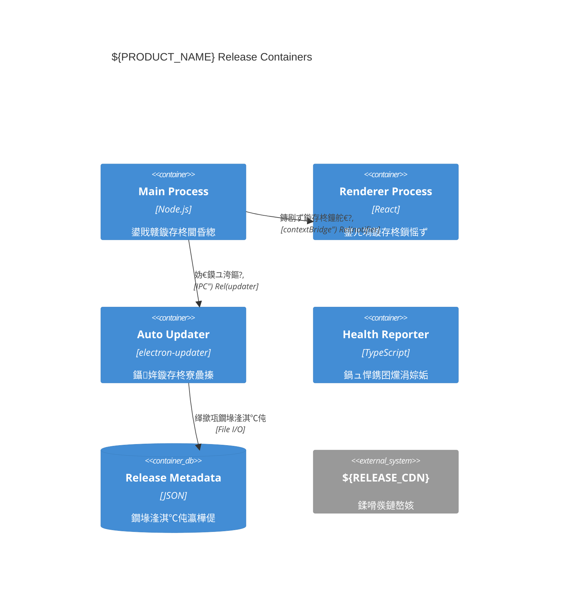

---
title: 10 i18n 路 Operations 路 Release 鈥?deep-optimized锛?5+路鍚€氶亾鐭╅樀/鍥炴粴锛?status: base-SSoT
adr_refs: [ADR-0001, ADR-0002, ADR-0003, ADR-0005, ADR-0008]
placeholders: ${APP_NAME}, ${PRODUCT_NAME}, ${ORG}, ${REPO}, ${RELEASE_CDN}, ${SENTRY_ORG}, ${SENTRY_PROJECT}, ${ENV}, ${RELEASE_PREFIX}, ${VERSION}, ${PRODUCT_DOWNLOAD_URL}
derived_from: 10-i18n-ops-release-v2.md
last_generated: 2025-08-21
---

> 鐩爣锛氬湪 optimized 鍩虹涓婅ˉ榻?**閫氶亾鐭╅樀锛圖ev/Staging/Prod锛?*銆?*绛惧悕/鍏瘉澶辫触鐨勯檷绾т笌鍛婅**銆?*鏇存柊鍥為€€绛栫暐** 涓?**i18n 鍙戝竷鍓嶈川閲忛棬绂?*锛岀‘淇濆伐绋嬮棴鐜€?
## 0.1 鍙戝竷涓婁笅鏂囪鍥撅紙C4 Context锛?
```mermaid
C4Context
    title Release Operations Context for ${PRODUCT_NAME}
    Person(admin, "Release Admin", "绠＄悊鍙戝竷娴佺▼鍜岀洃鎺?)
    Person(user, "End User", "鎺ユ敹鑷姩鏇存柊")
    System(app, "${PRODUCT_NAME} (Electron App)", "妗岄潰搴旂敤绋嬪簭")
    System_Ext(cdn, "${RELEASE_CDN}", "鍙戝竷鍒嗗彂缃戠粶")
    System_Ext(sentry, "${SENTRY_ORG}", "鐩戞帶涓庡仴搴锋寚鏍?)
    System_Ext(notary, "Apple Notary Service", "macOS鍏瘉鏈嶅姟")
    System_Ext(signing, "Code Signing Authority", "浠ｇ爜绛惧悕鏈嶅姟")

    Rel(admin, app, "鎵ц鍙戝竷娴佺▼", "CI/CD")
    Rel(app, cdn, "涓婁紶鏋勫缓浜х墿", "HTTPS")
    Rel(user, cdn, "涓嬭浇鏇存柊", "HTTPS")
    Rel(app, sentry, "涓婃姤鍋ュ悍鎸囨爣", "Crash-Free/Adoption")
    Rel(app, notary, "鎻愪氦鍏瘉", "notarytool")
    Rel(app, signing, "浠ｇ爜绛惧悕", "SignTool/codesign")
```

## 0.2 鍙戝竷瀹瑰櫒瑙嗗浘锛圕4 Container锛?


## A) 閫氶亾鐭╅樀涓庢斁閲忕瓥鐣?
```ts
export interface RolloutGate {
  metric: 'crashFreeUsers' | 'crashFreeSessions' | 'adoptionRate';
  threshold: number;
  waitMs: number;
  action: 'block' | 'warn' | 'rollback';
}
export const CHANNELS = {
  dev: {
    url: '${RELEASE_CDN}/dev',
    gates: [
      { metric: 'adoptionRate', threshold: 0.1, waitMs: 0, action: 'warn' },
    ],
  },
  staging: {
    url: '${RELEASE_CDN}/staging',
    gates: [
      {
        metric: 'crashFreeUsers',
        threshold: 99.0,
        waitMs: 3600000,
        action: 'block',
      },
    ],
  },
  prod: {
    url: '${RELEASE_CDN}/prod',
    gates: [
      {
        metric: 'crashFreeUsers',
        threshold: 99.5,
        waitMs: 3600000,
        action: 'rollback',
      },
    ],
  },
} as const;
```

## B) 绛惧悕/鍏瘉澶辫触鐨勯檷绾т笌鍙娴?
```ts
export interface SigNotarizeResult {
  platform: 'win' | 'mac';
  step: 'sign' | 'notarize' | 'staple' | 'verify';
  ok: boolean;
  msg?: string;
}
export function onSigNotarizeFailure(r: SigNotarizeResult) {
  /* 涓婃姤 Sentry & 瑙﹀彂鍛婅锛堜笌 03 绔犱竴鑷达級 */
}
```

## C) 鏇存柊鍥為€€锛堢増鏈繚鎶わ級

```ts
export interface RollbackPlan {
  maxAutoRollbacks: number;
  cooldownMs: number;
  channels: ReadonlyArray<keyof typeof CHANNELS>;
}
export class AutoRollback {
  private count = 0;
  constructor(private plan: RollbackPlan) {}
  async maybeRollback(metric: 'crashFreeUsers', value: number) {
    if (value < 99.5 && this.count < this.plan.maxAutoRollbacks) {
      this.count++; /* 鎵ц鍥為€€ */
    }
  }
}
```

## D) i18n 鍙戝竷闂ㄧ锛圞ey Debt锛?
```ts
export interface I18nDebt {
  locale: string;
  missing: number;
  ratio: number;
  criticalMissing: string[];
}
export function detectMissingTranslations(): Promise<I18nDebt[]> {
  return Promise.resolve([]);
} // 鍗犱綅

// 鍙戝竷浜嬩欢濂戠害
export interface ReleaseEvent {
  type:
    | '${DOMAIN_PREFIX}.release.started'
    | '${DOMAIN_PREFIX}.release.completed'
    | '${DOMAIN_PREFIX}.release.failed';
  version: string;
  channel: keyof typeof CHANNELS;
  timestamp: number;
}
export interface HealthEvent {
  type: '${DOMAIN_PREFIX}.health.threshold_breached';
  metric: string;
  value: number;
  threshold: number;
  channel: string;
}
export interface I18nEvent {
  type: '${DOMAIN_PREFIX}.i18n.validation_failed';
  locale: string;
  missingKeys: string[];
  completeness: number;
}
```

## E) CI 鐗囨锛堢鍚?鍏瘉/鍋ュ悍闂ㄧ锛?
```yaml
# .github/workflows/release.yml锛堟憳瑕侊級
name: Release Pipeline
on:
  push: { tags: ['v*'] }
  workflow_dispatch:
    {
      inputs:
        {
          channel:
            { required: true, type: choice, options: [dev, staging, prod] },
        },
    }

jobs:
  build:
    strategy: { matrix: { os: [windows-latest, macos-latest] } }
    steps:
      - name: Build & Package
        run: npm run build && npm run package:${{ matrix.os }}
      - name: Sign (Windows)
        if: matrix.os == 'windows-latest'
        run: powershell -ExecutionPolicy Bypass -File scripts/release/windows-sign.ps1
        env:
          {
            WINDOWS_CERT_FILE: '${{ secrets.WIN_CERT }}',
            WINDOWS_CERT_PASSWORD: '${{ secrets.WIN_CERT_PASS }}',
          }
      - name: Notarize (macOS)
        if: matrix.os == 'macos-latest'
        run: node scripts/release/macos-notarize.mjs
        env:
          {
            APPLE_ID: '${{ secrets.APPLE_ID }}',
            APPLE_PASSWORD: '${{ secrets.APPLE_PASSWORD }}',
          }
      - name: Health Gate
        run: node scripts/release/health-gate-check.mjs --channel=${{ github.event.inputs.channel || 'prod' }}
        env:
          { SENTRY_ORG: '${SENTRY_ORG}', SENTRY_PROJECT: '${SENTRY_PROJECT}' }
      - name: Upload to CDN
        run: node scripts/release/upload-artifacts.mjs --target=${RELEASE_CDN}/${{ github.event.inputs.channel }}
```

```powershell
# scripts/release/health-gate-check.mjs锛堝叧閿墖娈碉級
const thresholds = {
  dev: { crashFreeUsers: 98.0, adoptionRate: 0.1 },
  staging: { crashFreeUsers: 99.0, crashFreeSessions: 99.5 },
  prod: { crashFreeUsers: 99.5, crashFreeSessions: 99.8 }
};
```

## F) 楠屾敹娓呭崟锛堝惈鍥炴粴锛?
- [ ] HEALTH_GATES 鐢熸晥涓斿彲瑙﹀彂**鑷姩鍥炴粴**锛?- [ ] 閫氶亾鐭╅樀涓庨槇鍊煎彲閫氳繃 ENV 瑕嗙洊锛?- [ ] 绛惧悕/鍏瘉澶辫触杩涘叆闄嶇骇璺緞骞?*浜х敓鍛婅**锛?- [ ] i18n 瀹屾暣搴?鈮?5%锛?*鍏抽敭 keys 涓嶅緱缂哄け**锛?- [ ] 涓?02/03/07 绔犺妭鐨勭瓥鐣ュ紩鐢?*灏辫繎鍙**銆?
