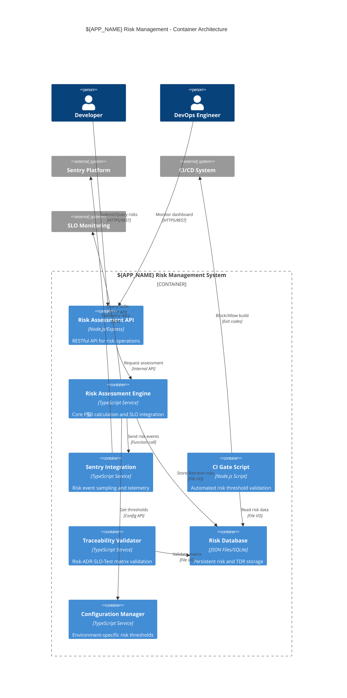
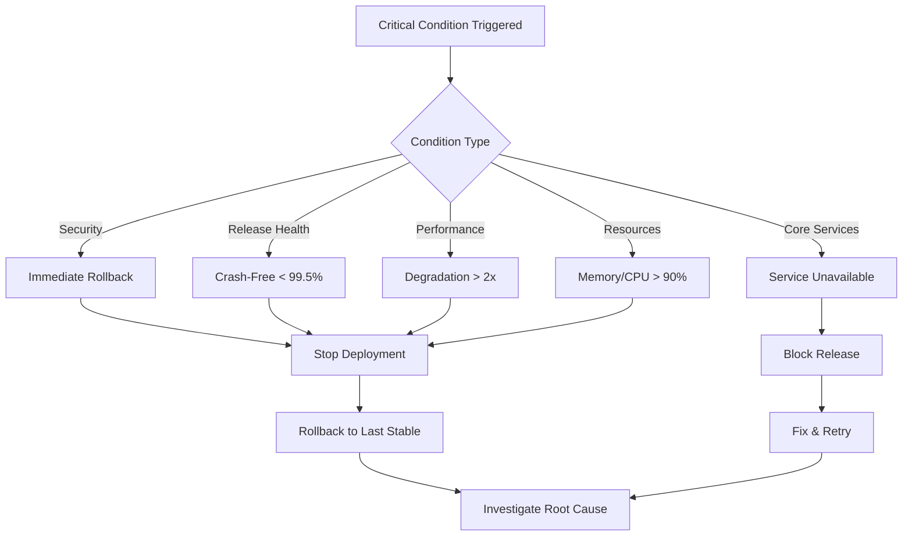

---
title: 11 Risks & Technical Debt 鈥?deep-optimized锛?5+路鍚嚜鍔ㄨ瘎浼?鍛婅/闂ㄧ锛?status: base-SSoT
adr_refs: [ADR-0003, ADR-0005]
placeholders: ${APP_NAME}, ${PRODUCT_NAME}, ${PRODUCT_SLUG}, ${DOMAIN_PREFIX}, ${SENTRY_ORG}, ${SENTRY_PROJECT}, ${RELEASE_PREFIX}, ${VERSION}, ${ENV}
derived_from: 11-risks-and-technical-debt-v2.md
last_generated: 2025-08-21
---

> 鍦?optimized 鍩虹涓婏紝琛ラ綈 **杩炵画璇勪及锛圫LO/閿欒/鎬ц兘锛?*銆?*Sentry 椋庨櫓浜嬩欢**銆?\*CI 椋庨櫓闂ㄧ** 涓?**杩借釜鐭╅樀鏍￠獙\*\*锛屽舰鎴愬伐绋嬮棴鐜€?

## 绯荤粺涓婁笅鏂囨灦鏋勶紙C4 Context锛?

```mermaid
C4Context
    title ${APP_NAME} Risk Management System Context

    Person(developer, "Developer", "寮€鍙戜汉鍛橈紝璇嗗埆鍜屾姤鍛婇闄?)
    Person(devops, "DevOps Engineer", "杩愮淮宸ョ▼甯堬紝鐩戞帶椋庨櫓闂ㄧ")

    System(risk_mgmt, "${APP_NAME} Risk Management", "椋庨櫓璇嗗埆銆佽瘎浼般€佺紦瑙ｅ拰鐩戞帶绯荤粺")

    System_Ext(sentry, "Sentry Platform", "閿欒鐩戞帶鍜屾€ц兘杩借釜骞冲彴")
    System_Ext(ci_system, "CI/CD System", "鎸佺画闆嗘垚鍜岄儴缃茬郴缁?)
    System_Ext(slo_monitor, "SLO Monitoring", "鏈嶅姟绾у埆鐩爣鐩戞帶绯荤粺")

    Rel(developer, risk_mgmt, "璇嗗埆鍜岃瘎浼伴闄?, "Risk API")
    Rel(devops, risk_mgmt, "鐩戞帶椋庨櫓鐘舵€?, "Dashboard")

    Rel(risk_mgmt, sentry, "鍙戦€侀闄╀簨浠?, "SDK/API")
    Rel(risk_mgmt, ci_system, "闃绘柇楂橀闄╂瀯寤?, "Gate Script")
    Rel(risk_mgmt, slo_monitor, "鑾峰彇SLO鍋ュ悍鐘舵€?, "Metrics API")

    Rel(sentry, risk_mgmt, "杩斿洖鐩戞帶鏁版嵁", "Webhook")
    Rel(slo_monitor, risk_mgmt, "鎻愪緵鎬ц兘鎸囨爣", "Query API")
```

## A) 杩炵画璇勪及锛圥脳I 鍔ㄦ€佸寲锛?

### 椋庨櫓璇勪及鏍稿績绠楁硶

```ts
// src/services/risk-assessor.ts锛堟憳瑕侊級
export class RiskAssessor {
  constructor(
    private slo: {
      get: (
        id: string
      ) => Promise<{ target: number; actual: number; healthy: boolean }>;
    }
  ) {}

  async assess(p: number, sloId: string) {
    const s = await this.slo.get(sloId);
    const impact = !s.healthy
      ? Math.abs(s.actual - s.target) / Math.max(s.target, 1) > 0.5
        ? 5
        : 3
      : 1;
    const riskScore = p * impact;
    const riskLevel =
      riskScore >= 21
        ? 'critical'
        : riskScore >= 13
          ? 'high'
          : riskScore >= 7
            ? 'medium'
            : 'low';
    return { impact, riskScore, riskLevel };
  }

  // 鎵归噺璇勪及浼樺寲
  async assessBatch(
    risks: Array<{ id: string; probability: number; sloId: string }>
  ) {
    const results = await Promise.allSettled(
      risks.map(r => this.assess(r.probability, r.sloId))
    );
    return results.map((r, i) => ({
      riskId: risks[i].id,
      result: r.status === 'fulfilled' ? r.value : null,
      error: r.status === 'rejected' ? r.reason : null,
    }));
  }
}
```

### 鐜鍙橀噺閰嶇疆

```powershell
# .env.risk-assessment
RISK_ASSESSMENT_INTERVAL=300000  # 5鍒嗛挓璇勪及闂撮殧
RISK_SLO_TIMEOUT=5000           # SLO鏌ヨ瓒呮椂
RISK_BATCH_SIZE=10              # 鎵归噺璇勪及澶у皬
RISK_CACHE_TTL=60000            # 缂撳瓨鏃堕棿1鍒嗛挓
```

## 鎶€鏈鍣ㄦ灦鏋勶紙C4 Container锛?



## B) Sentry 椋庨櫓浜嬩欢涓庨噰鏍?

### 澧炲己鐗堥闄╅仴娴?

```ts
// src/services/sentry-risk.ts锛堝榻?搂03锛?import * as Sentry from '@sentry/electron/renderer';

export interface RiskTelemetryConfig {
  dsn: string;
  environment: string;
  release: string;
  riskSamplingRates: Record<RiskLevel, number>;
  enablePerformanceRisk: boolean;
}

export function initRiskTelemetry(config?: Partial<RiskTelemetryConfig>) {
  const defaultConfig: RiskTelemetryConfig = {
    dsn: process.env.SENTRY_DSN!,
    environment: process.env.NODE_ENV || 'development',
    release: process.env.RELEASE_PREFIX + process.env.VERSION,
    riskSamplingRates: { critical: 1.0, high: 0.8, medium: 0.3, low: 0.1 },
    enablePerformanceRisk: true,
  };

  const finalConfig = { ...defaultConfig, ...config };

  Sentry.init({
    dsn: finalConfig.dsn,
    environment: finalConfig.environment,
    release: finalConfig.release,
    tracesSampler: ctx => {
      const risk = ctx['riskLevel'] as RiskLevel | undefined;
      return risk ? finalConfig.riskSamplingRates[risk] : 0.1;
    },
    beforeSend(event) {
      // 涓洪闄╀簨浠舵坊鍔犱笂涓嬫枃鏍囩
      if (event.tags?.category === 'risk') {
        event.tags.product = process.env.PRODUCT_SLUG;
        event.tags.domain = process.env.DOMAIN_PREFIX;
      }
      return event;
    },
  });
}

export function captureRisk(
  msg: string,
  level: RiskLevel,
  extra?: Record<string, any>
) {
  Sentry.addBreadcrumb({
    category: 'risk',
    message: msg,
    level:
      level === 'critical' ? 'error' : level === 'high' ? 'warning' : 'info',
    data: extra,
  });

  if (level === 'critical' || level === 'high') {
    Sentry.captureMessage(`[RISK] ${msg}`, {
      level: 'warning',
      tags: { riskLevel: level, category: 'risk' },
      extra: extra,
    });
  }
}

type RiskLevel = 'low' | 'medium' | 'high' | 'critical';
```

## C) CI 椋庨櫓闂ㄧ锛堣仛鍚堟寚鏍囷級

### 澧炲己鐗堥棬绂佽剼鏈?

```js
// scripts/ci/risk-gate.mjs锛堝寮虹増锛?import fs from 'node:fs/promises';
import path from 'node:path';

// 鍙厤缃殑椋庨櫓闃堝€?const CONFIG = {
  thresholds: {
    maxCritical: parseInt(process.env.RISK_MAX_CRITICAL || '0'),
    maxHigh: parseInt(process.env.RISK_MAX_HIGH || '3'),
    maxScore: parseInt(process.env.RISK_MAX_SCORE || '15'),
    maxTotalRisks: parseInt(process.env.RISK_MAX_TOTAL || '20'),
  },
  paths: {
    riskData: process.env.RISK_DATA_PATH || 'var/risks.json',
    reportOutput: process.env.RISK_REPORT_PATH || 'reports/risk-gate.json',
  },
  exitOnFailure: process.env.RISK_GATE_ENFORCE !== 'false',
};

try {
  const risks = JSON.parse(await fs.readFile(CONFIG.paths.riskData, 'utf8'));
  const stats = calculateRiskStats(risks);
  const result = evaluateRiskGate(stats, CONFIG.thresholds);

  // 鐢熸垚璇︾粏鎶ュ憡
  await generateRiskReport(result, stats, risks);

  console.log(`馃攳 Risk Gate Analysis: ${risks.length} risks evaluated`);
  console.log(
    `馃搳 Stats: Critical=${stats.critical}, High=${stats.high}, Max Score=${stats.maxScore}`
  );

  if (!result.passed) {
    console.error('鉂?Risk gate failed:', result.failures);
    if (CONFIG.exitOnFailure) process.exit(1);
  } else {
    console.log('鉁?Risk gate passed - all thresholds met');
  }
} catch (error) {
  console.error('馃挜 Risk gate error:', error.message);
  if (CONFIG.exitOnFailure) process.exit(1);
}

function calculateRiskStats(risks) {
  const stats = {
    critical: 0,
    high: 0,
    medium: 0,
    low: 0,
    maxScore: 0,
    total: risks.length,
  };
  for (const r of risks) {
    stats[r.riskLevel]++;
    stats.maxScore = Math.max(stats.maxScore, r.riskScore);
  }
  return stats;
}

function evaluateRiskGate(stats, thresholds) {
  const failures = [];
  if (stats.critical > thresholds.maxCritical)
    failures.push(
      `Critical risks: ${stats.critical} > ${thresholds.maxCritical}`
    );
  if (stats.high > thresholds.maxHigh)
    failures.push(`High risks: ${stats.high} > ${thresholds.maxHigh}`);
  if (stats.maxScore > thresholds.maxScore)
    failures.push(`Max score: ${stats.maxScore} > ${thresholds.maxScore}`);
  if (stats.total > thresholds.maxTotalRisks)
    failures.push(`Total risks: ${stats.total} > ${thresholds.maxTotalRisks}`);

  return { passed: failures.length === 0, failures, stats };
}

async function generateRiskReport(result, stats, risks) {
  const report = {
    timestamp: new Date().toISOString(),
    gatePassed: result.passed,
    statistics: stats,
    failures: result.failures,
    riskBreakdown: risks.reduce((acc, r) => {
      acc[r.category] = (acc[r.category] || 0) + 1;
      return acc;
    }, {}),
  };

  await fs.mkdir(path.dirname(CONFIG.paths.reportOutput), { recursive: true });
  await fs.writeFile(
    CONFIG.paths.reportOutput,
    JSON.stringify(report, null, 2)
  );
}
```

### Package.json 闆嗘垚

```json
{
  "scripts": {
    "risk:assess": "node scripts/risk-assess.mjs",
    "risk:gate": "node scripts/ci/risk-gate.mjs",
    "risk:report": "node scripts/risk-report.mjs",
    "ci:risk-check": "npm run risk:assess && npm run risk:gate"
  }
}
```

## D) 杩借釜鐭╅樀鏍￠獙锛圧isk/TDR 鈫?ADR/SLO/Tests锛?

### 鐭╅樀鏍￠獙鏈嶅姟

```ts
// src/services/traceability-validate.ts锛堟憳瑕侊級
export interface TraceabilityMatrix {
  risks: Array<{
    id: string;
    affectedSLOs?: string[];
    relatedADRs?: string[];
    testRefs?: string[];
  }>;
  tdrs: Array<{ id: string; relatedADRs?: string[]; testRefs?: string[] }>;
  adrs: Array<{ id: string; status: string }>;
  tests: Array<{ id: string; type: string }>;
}

export interface ValidationResult {
  passed: boolean;
  issues: string[];
  warnings: string[];
  coverage: {
    risksWithSLO: number;
    risksWithADR: number;
    risksWithTests: number;
    tdrsWithADR: number;
    totalRisks: number;
    totalTdrs: number;
  };
}

export function validateTrace(matrix: TraceabilityMatrix): ValidationResult {
  const issues: string[] = [];
  const warnings: string[] = [];

  // 楠岃瘉椋庨櫓杩借釜瀹屾暣鎬?  let risksWithSLO = 0,
    risksWithADR = 0,
    risksWithTests = 0;
  for (const r of matrix.risks) {
    if (!r.affectedSLOs?.length) {
      issues.push(`Risk ${r.id} missing SLO link`);
    } else {
      risksWithSLO++;
    }

    if (!r.relatedADRs?.length) {
      issues.push(`Risk ${r.id} missing ADR link`);
    } else {
      risksWithADR++;
      // 楠岃瘉ADR鐘舵€?      for (const adrId of r.relatedADRs) {
        const adr = matrix.adrs.find(a => a.id === adrId);
        if (!adr || adr.status !== 'Accepted') {
          warnings.push(`Risk ${r.id} references non-accepted ADR ${adrId}`);
        }
      }
    }

    if (r.testRefs?.length) {
      risksWithTests++;
    } else {
      warnings.push(`Risk ${r.id} has no test coverage`);
    }
  }

  // 楠岃瘉鎶€鏈€鸿拷韪?  let tdrsWithADR = 0;
  for (const tdr of matrix.tdrs) {
    if (tdr.relatedADRs?.length) {
      tdrsWithADR++;
    } else {
      warnings.push(`TDR ${tdr.id} missing ADR reference`);
    }
  }

  const coverage = {
    risksWithSLO,
    risksWithADR,
    risksWithTests,
    tdrsWithADR,
    totalRisks: matrix.risks.length,
    totalTdrs: matrix.tdrs.length,
  };

  return {
    passed: issues.length === 0,
    issues,
    warnings,
    coverage,
  };
}

// 鐢熸垚杩借釜鐭╅樀鎶ュ憡
export function generateTraceReport(result: ValidationResult): string {
  const { coverage } = result;
  const sloCompliance = (
    (coverage.risksWithSLO / coverage.totalRisks) *
    100
  ).toFixed(1);
  const adrCompliance = (
    (coverage.risksWithADR / coverage.totalRisks) *
    100
  ).toFixed(1);
  const testCoverage = (
    (coverage.risksWithTests / coverage.totalRisks) *
    100
  ).toFixed(1);

  return `
## 杩借釜鐭╅樀鍚堣鎶ュ憡

### 椋庨櫓杩借釜瑕嗙洊鐜?- SLO鍏宠仈: ${coverage.risksWithSLO}/${coverage.totalRisks} (${sloCompliance}%)
- ADR鍏宠仈: ${coverage.risksWithADR}/${coverage.totalRisks} (${adrCompliance}%)
- 娴嬭瘯瑕嗙洊: ${coverage.risksWithTests}/${coverage.totalRisks} (${testCoverage}%)

### 鎶€鏈€鸿拷韪?- ADR鍏宠仈: ${coverage.tdrsWithADR}/${coverage.totalTdrs}

### 闂娓呭崟
${result.issues.map(i => `- 鉂?${i}`).join('\n')}

### 璀﹀憡娓呭崟
${result.warnings.map(w => `- 鈿狅笍 ${w}`).join('\n')}
  `.trim();
}
```

## E) 楠屾敹娓呭崟锛堥棬绂?杩借釜锛?

### 瀹屾暣楠屾敹娴佺▼

- [ ] 椋庨櫓闂ㄧ鍦?CI 鍙樆鏂紙鍚粺璁¤緭鍑哄拰鎶ュ憡鐢熸垚锛?- [ ] Sentry 浜嬩欢鍖呭惈椋庨櫓涓婁笅鏂囷紙Breadcrumb/Level/Tags锛?- [ ] 杩借釜鐭╅樀鏍￠獙閫氳繃锛堟棤瀛ょ珛 Risk/TDR锛岃鐩栫巼 鈮?0%锛?- [ ] 椋庨櫓瀹氭湡澶嶇洏锛堣嚜鍔ㄧ敓鎴愭姤鍛婏紝鏀寔瓒嬪娍鍒嗘瀽锛?- [ ] 鐜鍙橀噺閰嶇疆瀹屾暣锛堝紑鍙?娴嬭瘯/鐢熶骇鐜宸紓鍖栭槇鍊硷級
- [ ] 鎵归噺璇勪及鎬ц兘浼樺寲锛堟敮鎸佸苟鍙戝鐞嗭紝閬垮厤SLO鏌ヨ瓒呮椂锛?

### 鐩戞帶闆嗘垚妫€鏌?

- [ ] 椋庨櫓浜嬩欢鍦?${SENTRY_ORG}/${SENTRY_PROJECT} 椤圭洰涓彲瑙?- [ ] CI 鏋勫缓鏃ュ織鍖呭惈璇︾粏鐨勯闄╃粺璁′俊鎭?- [ ] 杩借釜鐭╅樀鎶ュ憡鑷姩鐢熸垚鍒?`reports/` 鐩綍
- [ ] 椋庨櫓闃堝€煎彲閫氳繃鐜鍙橀噺鍔ㄦ€佽皟鏁?

### Workflow 闆嗘垚绀轰緥

```yaml
# .github/workflows/risk-assessment.yml
name: Risk Assessment Gate
on: [pull_request]
jobs:
  risk-gate:
    runs-on: ubuntu-latest
    steps:
      - uses: actions/checkout@v4
      - uses: actions/setup-node@v4
        with: { node-version: '18' }
      - run: npm ci
      - name: Risk Assessment
        env:
          RISK_MAX_CRITICAL: 0
          RISK_MAX_HIGH: 2
          RISK_GATE_ENFORCE: true
        run: npm run ci:risk-check
      - name: Upload Risk Report
        uses: actions/upload-artifact@v4
        with:
          name: risk-reports
          path: reports/
```

## G) Critical鏉′欢妫€鏌ユ竻鍗曪紙椋庨櫓/鍥炴粴鏈哄埗锛?

### G.1) Critical鏉′欢瀹氫箟锛堜笉鍙Ε鍗忥級



### G.2) Critical妫€鏌ョ煩闃?

| 妫€鏌ョ被鍨?       | Critical闃堝€?         | 妫€娴嬫柟娉? | 瑙﹀彂鍔ㄤ綔 |
| ------------------ | ---------------------- | ------------ | ------------ |
| **瀹夊叏鍩虹嚎**   | contextIsolation=false | 鎵弿main.ts | 绔嬪嵆鍥炴粴 |
| **Release Health** | Crash-Free < 99.5%     | Sentry API   | 绔嬪嵆鍥炴粴 |
| **鏍稿績鏈嶅姟**   | 鏁版嵁搴撲笉鍙敤      | 渚濊禆妫€鏌? | 闃绘鍙戝竷  |
| **鎬ц兘**          | 鍚姩鏃堕棿 > 10s      | 鍩虹嚎瀵规瘮 | 绔嬪嵆鍥炴粴 |
| **璧勬簮**         | 鍐呭瓨浣跨敤 > 90%     | 绯荤粺鐩戞帶 | 绔嬪嵆鍥炴粴 |

### G.3) 鑷姩鍖栨鏌ヨ剼鏈?

```json
{
  "scripts": {
    "critical:check": "node scripts/critical_conditions_checklist.mjs"
  }
}
```

**浣跨敤鏂规硶**锛?

```powershell
# 鍙戝竷鍓岰ritical鏉′欢楠岃瘉
npm run critical:check

# CI闆嗘垚锛堝湪release workflow涓級
- name: Critical Conditions Check
  run: npm run critical:check
```

**杈撳嚭鏍煎紡**锛?

- 鉁?PASS - 鍙畨鍏ㄥ彂甯?- 鈿狅笍 WARN - 璋ㄦ厧缁х画
- 鉂?FAIL - 闃绘鍙戝竷
- 馃毃 CRITICAL - 绔嬪嵆鍥炴粴

## H) 楠屾敹娓呭崟锛堟渶灏忓悎瑙勶級

- [ ] 鎶€鏈€哄姟璇勫垎绯荤粺鍙墽琛岋紙`npm run debt:check`锛?- [ ] 姣忎釜`FIXME`/`TODO`鍧囨湁璐ｄ换浜哄拰棰勬湡瑙ｅ喅鏃ユ湡
- [ ] 鏋舵瀯鍐崇瓥鍐宠锛圓DR锛夎褰曡嚦灏戞瘡瀛ｅ害涓€娆″洖椤?- [ ] 渚濊禆椤规鏌ヨ剼鏈彲鍦–I杩愯锛屽苟鎶ュ憡杩囨湡/鑴嗗急渚濊禆
- [ ] **Critical鏉′欢妫€鏌ヨ剼鏈泦鎴愬埌鍙戝竷娴佺▼**锛坄npm run critical:check`锛?- [ ] \*_鎵€鏈塁ritical鏉′欢瀹氫箟鏄庣‘涓斿彲鑷姩鍖栨娴?_
- [ ] \*_鍥炴粴鏈哄埗缁忚繃娴嬭瘯楠岃瘉锛屽彲鍦?鍒嗛挓鍐呮墽琛?_
